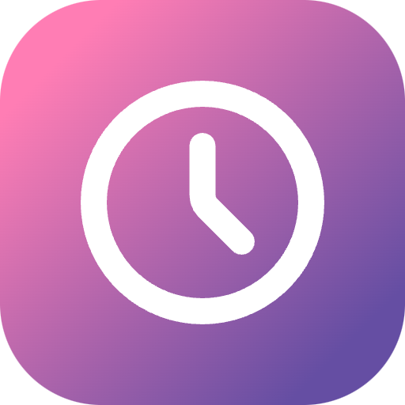
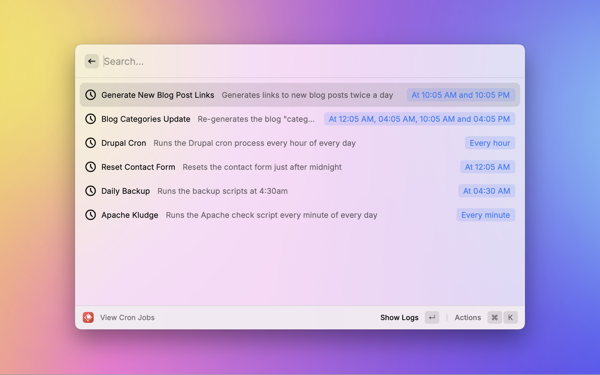
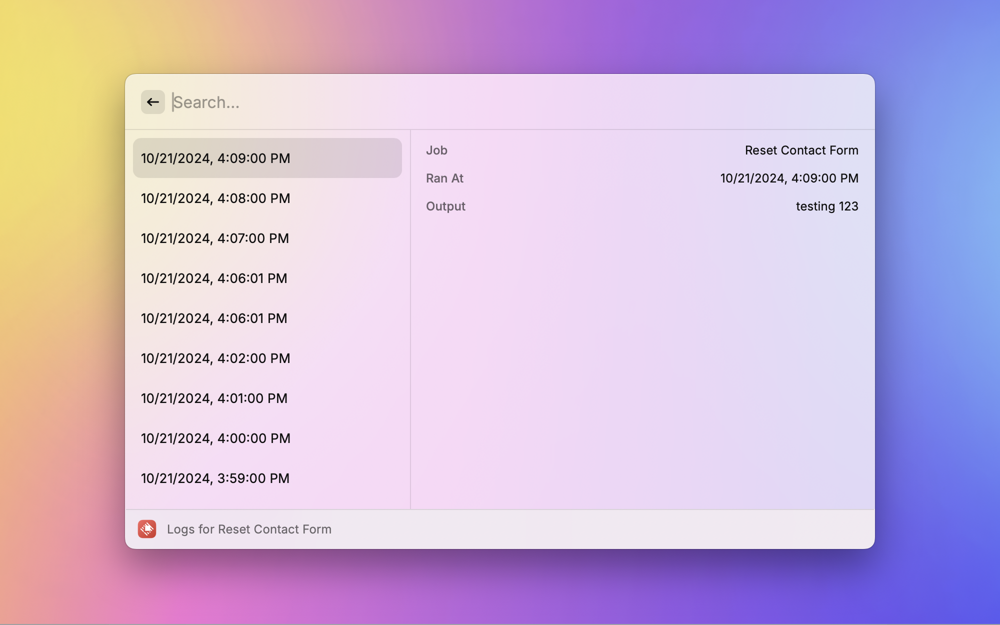
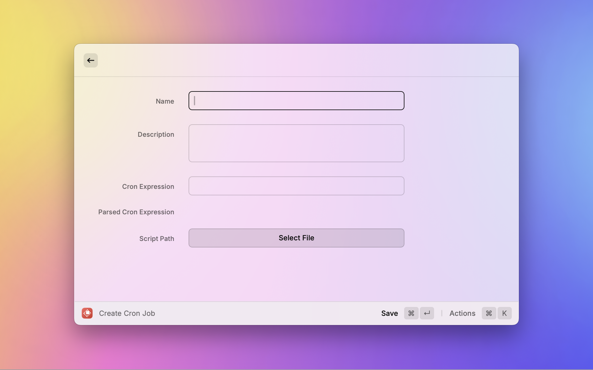
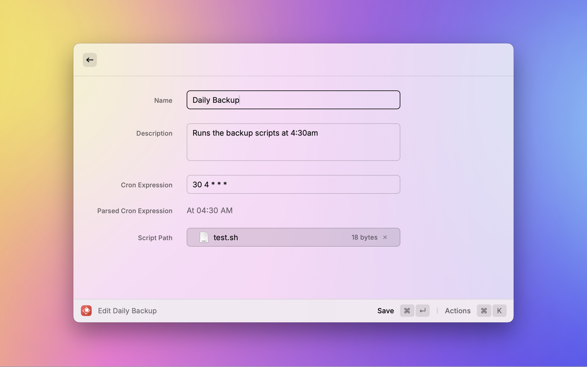
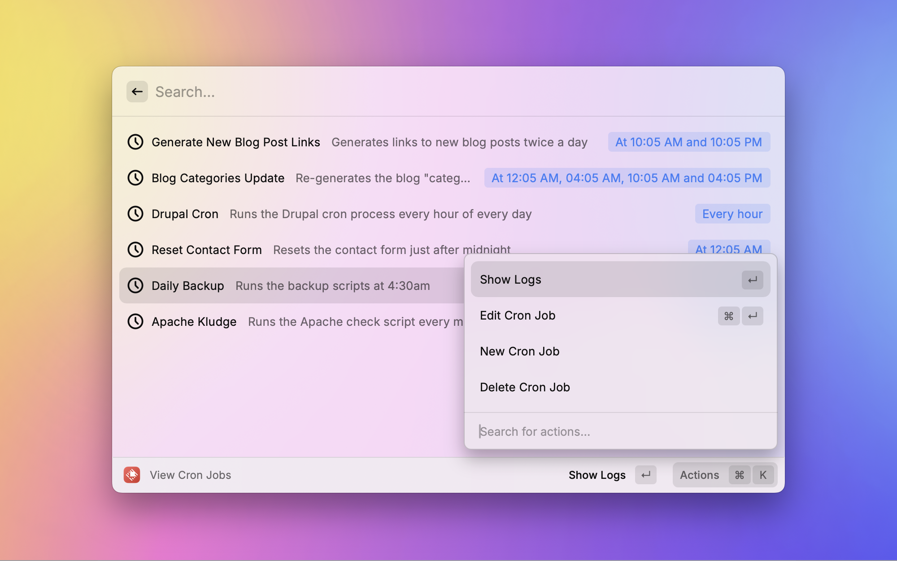

<p align="center">

</p>

<h1 align="center">Cron Manager</h1>

<h3 align="center">
Cron Manager is a Raycast extension that allows you to manage your cron jobs from a GUI.
</h3>

## Features

### View Your Cron Jobs

View and search all your cron jobs.



### View Log Output

View the output of your cron jobs.



### Add New Cron Jobs

Quickly add new cron jobs to your system.



### Edit Cron Jobs

Edit existing cron jobs.



### Delete Cron Jobs

Delete cron jobs from your system.



## Setup

This extension has only been tested on MacOS Sequoia. If you have any issues, please open an issue on the [GitHub repository](https://github.com/cartermcalister/cron-manager).

It uses crontab to display and edit your cron jobs. If you have existing cron jobs, you will need to add a `# Name:` and `# Description:` to each job. See below for an example.

```text
# Name: Daily Backup
# Description: Runs the backup scripts at 4:30am
30 4 * * * ~/Developer/scripts/cron/backup.sh

# Name: Apache Kludge
# Description: Runs the Apache check script every minute of every day
* * * * * ~/Developer/scripts/cron/check-apache.sh
```

## Author

Created by [Carter McAlister](https://github.com/cartermcalister)
