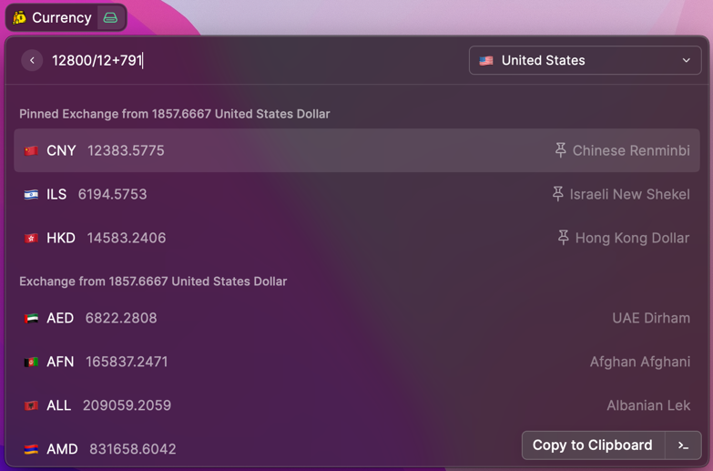
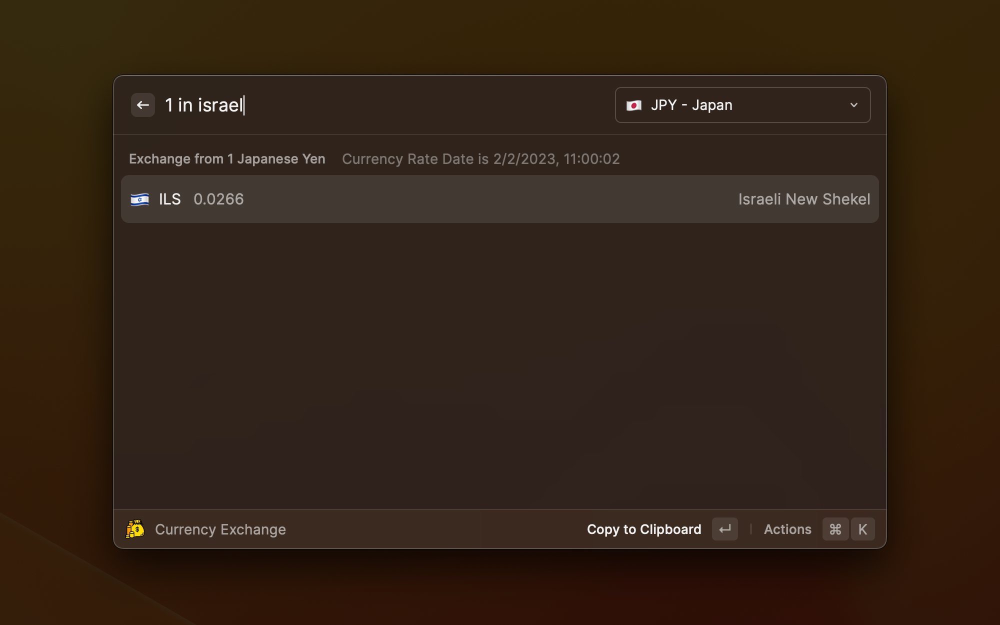

# Raycast Currency Exchange extension

## Features
* Support 161 currencies, see list: https://www.exchangerate-api.com/docs/supported-currencies
* Support calculate expression e.g `1+2/3*4`
* Support find target currency by filter, format: `${expression} in ${filter key word}`
* Support pin your favorite currencies
* Remember the source currency

calculate currency exchange expression

find target currency with filter

## How to get API Keys
* Go to https://www.exchangerate-api.com/ and register a account, it is free
* Go to https://app.exchangerate-api.com/keys to find your API Key

currency rate will be queried every 24 hours to reduce API usage.

### why I create another currency extension?
There's a currency exchange function out of box in Raycast's Calculator.
You can type like `12 usd in gbp` to show the currency exchange result.
In some case, when you exactly know the currency code, it works fine, but it still has some challanges:
1. Sometimes, if you are not native speaker, you may not know the exact currency code, since it is always 3 chars like `KRW`, the `W` is from `Won` in Korea, not easy to understand.
2. Some case, I want to always use a dedicate source currecy, not type it always.
3. Some case, I want to focus on a few dedicated currecies, just type number, get result.
Based on above reason, I created a new one.