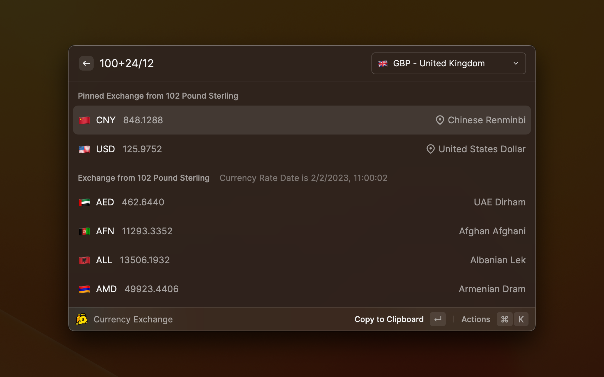

# Raycast Currency Exchange extension

## Features

* Support 161 currencies, see list: https://www.exchangerate-api.com/docs/supported-currencies
* Support calculate expression e.g `1+2/3*4`
* Support find target currency by filter, format: `${expression} in ${filter key word}`
* Support pin your favorite currencies
* Remember the source currency
* Support find historical currency by date, format: `${expression} at ${yyyy/mm/dd}` or use Action 'Set Currency Date' [*Attention]

\* use historical currency needs Pro/Business/Volume Plan subscription, Free version does not allow query historical currency API.
See detail:
https://www.exchangerate-api.com/docs/historical-data-requests

**If anyone find free version API for currency historical data, please contact with me!**

## Screenshots

calculate currency exchange expression

find target currency with filter

exchange with historical currency

## How to get API Keys

* Go to https://www.exchangerate-api.com/ and register a account, it is free
* Go to https://app.exchangerate-api.com/keys to find your API Key

currency rate will be queried every 24 hours to reduce API usage.

### why I create another currency extension?

There's a currency exchange function out of box in Raycast's Calculator.

* You can type like `12 usd in gbp` to show the currency exchange result.

* You can type like `12 usd in gbp at 2022/9/25` to show the historical currency exchange result. (Need API Pro/Business/Volume Plan subscription)

In some case, when you exactly know the currency code, it works fine, but it still has some challenges:

1. Sometimes, if you are not native speaker, you may not know the exact currency code, since it is always 3 chars like `KRW`, the `W` is from `Won` in Korea, not easy to understand.
2. Some case, I want to always use a dedicate source currency, not type it always.
3. Some case, I want to focus on a few dedicated currencies, just type number, get result.
   Based on above reason, I created a new one.