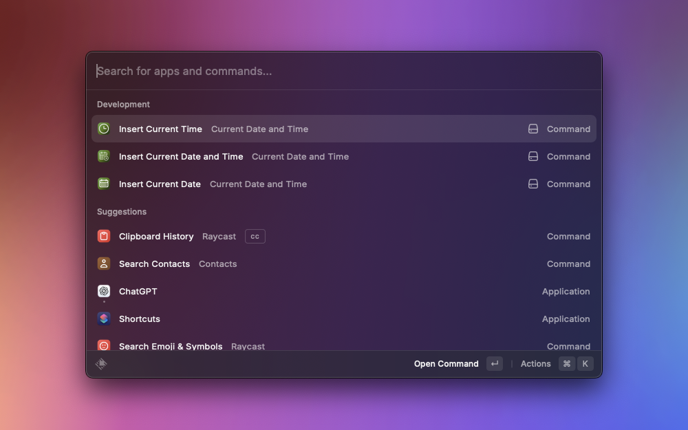

# Current Date and Time

This Raycast extension allows you to quickly insert the current date and/or time into your documents.

## Features

- **Insert Date and Time**: Inserts the current date and time based on your preferences.
- **Insert Date**: Inserts the current date based on your preferences.
- **Insert Time**: Inserts the current time based on your preferences.

## Preferences

You can customize the following preferences in the Raycast extension settings:

- **Use 24-hour format**: Choose whether to use the 24-hour format for time.
- **Date format**: Choose the date format to use (EU: DD.MM.YYYY, ISO: YYYY-MM-DD, US: MM/DD/YYYY).

## Commands

### Insert Date and Time

- **Name**: Insert date and time
- **Description**: Paste the current date and time into the active document.

### Insert Date

- **Name**: Insert date
- **Description**: Paste the current date into the active document.

### Insert Time

- **Name**: Insert time
- **Description**: Paste the current time into the active document.

## Screenshot

