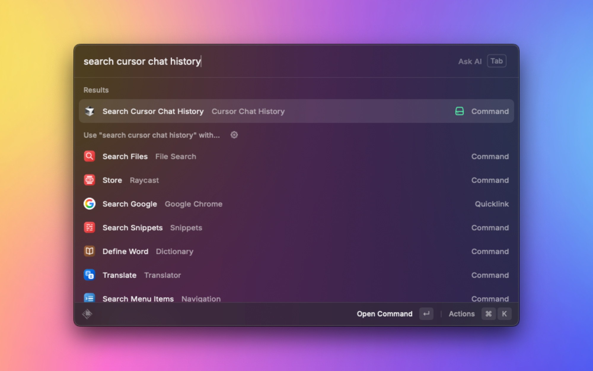

# Cursor Chat History Search

Search and access your Cursor AI chat history instantly from Raycast

[![raycast-cross-extension-badge]][raycast-cross-extension-link]



## Features

Quickly find and revisit your past AI conversations from Cursor without leaving Raycast.

- 🔍 **Fast Search**: Full-text search across all chat titles and content
- 🏢 **Multi-Workspace**: Search chat history from all your Cursor workspaces
- 📋 **Quick Copy**: Copy chat content to clipboard with one click
- 🎼 **Smart Detection**: Automatically distinguishes between regular chats and Composer sessions
- 📖 **Rich Preview**: View chat content with proper markdown formatting
- ⚡ **Instant Access**: No need to open Cursor to browse your chat history

## How to Use

1. Open Raycast and type "Search Cursor Chat History"
2. Enter keywords to search through your chat history
3. Browse results with workspace and timestamp information
4. Select any chat to view full conversation
5. Use ⌘C to copy content or ⌘K for more actions

## What Gets Searched

- All AI chat conversations from Cursor
- Composer session history
- Chat titles and full message content
- Conversations across all your workspaces

## Requirements

- **Cursor**: Must be installed and have some chat history
- **macOS**: Compatible with macOS 10.15 and later
- **Storage**: Reads from Cursor's local data at `~/Library/Application Support/Cursor/User/workspaceStorage`

## Troubleshooting

**No results found?**

- Make sure you have some chat history in Cursor
- Try different search keywords
- Restart Cursor if you just created new chats

**Missing recent chats?**

- Close and reopen the extension to refresh data
- Ensure Cursor has properly saved your recent conversations

---

## For Developers

Want to contribute or report issues? Visit our [GitHub repository](https://github.com/raycast/extensions).

```bash
# Development setup
npm install && npm run dev
```

[raycast-cross-extension-badge]: https://shields.io/badge/Raycast-Cross--Extension-eee?labelColor=FF6363&logo=raycast&logoColor=fff&style=flat-square
[raycast-cross-extension-link]: https://github.com/LitoMore/raycast-cross-extension-conventions
