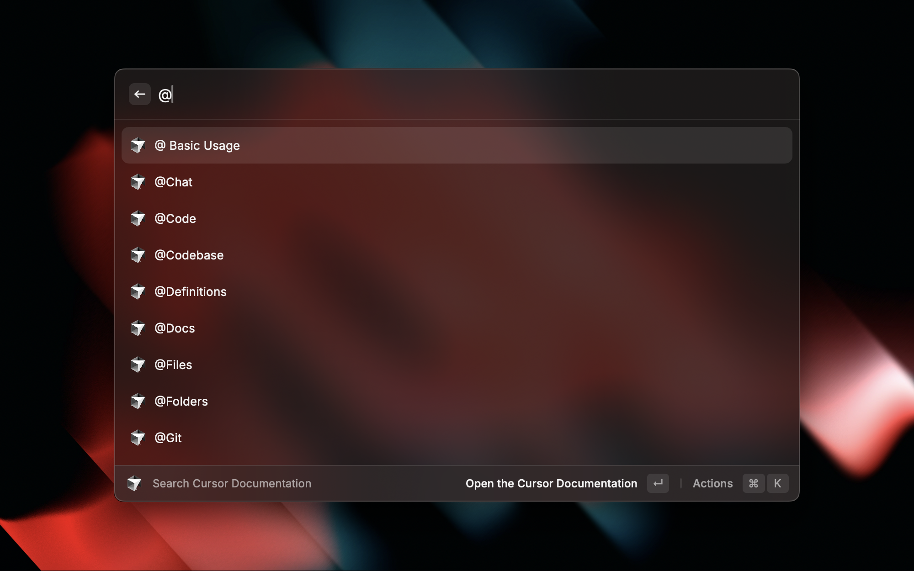

# Search Cursor Documentation



## What is this extension

- Search Cursor Recent Projects
- Use `Open With Cursor` command
- Use `Open New Window` command
- Show Installed Extensions list
- Search & Install Extension from VSCode Marketplace
- Reach and search the Cursor Documentation in an instant right from Raycast without any hassle.

## How to add to the extension

### Bugs and suggestions

Suggestions are always welcome and can be added [via Github Issues](https://github.com/raycast/extensions/issues/new?title=%5BCursor%5D+...&template=extension_bug_report.yml&labels=extension,bug&extension-url=https://www.raycast.com/degouville/cursor&body=%0A%3C!--%0APlease+update+the+title+above+to+consisely+describe+the+issue%0A--%3E%0A%0A%2523%2523%2523+Extension%0A%0Ahttps://raycast.com/%2523%7Bextension_path(extension)%7D%0A%0A%2523%2523%2523+Description%0A%0A%3C!--%0APlease+provide+a+clear+and+concise+description+of+what+the+bug+is.+Include+screenshots+if+needed.+Please+test+using+the+latest+version+of+the+extension,+Raycast+and+API.%0A--%3E%0A%0A%2523%2523%2523+Steps+To+Reproduce%0A%0A%3C!--%0AYour+bug+will+get+fixed+much+faster+if+the+extension+author+can+easily+reproduce+it.+Issues+without+reproduction+steps+may+be+immediately+closed+as+not+actionable.%0A--%3E%0A%0A1.+In+this+environment...%0A2.+With+this+config...%0A3.+Run+%27...%27%0A4.+See+error...%0A%0A%2523%2523%2523+Current+Behavior%0A%0A%2523%2523%2523+Expected+Behavior%0A%0A)

### Development

```bash
# To install dependencies
bun i

# To start the local development server
bun run dev
```

All documentation items are defined in `src/data/docs.ts`. You can add new items there, types and IntelliSense supported. Each documentation item can have it's own display`title`, `url`, `icon` and `keywords`. Only the title is required.

```bash
# To lint and fix
bun run fix-lint

# To locally build the extension
bun run build
```
