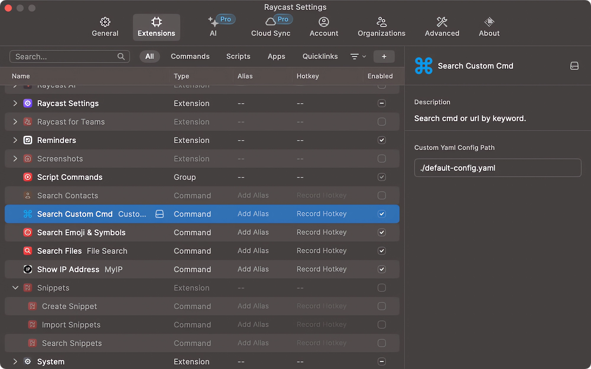

# Custom Command Search

You can customize commonly used URLs or commands, and then use this plugin for quick access. This plugin can be very useful in situations where a platform provides multiple environments.

Then You can use the yaml path in the custom command file for multi device synchronization

