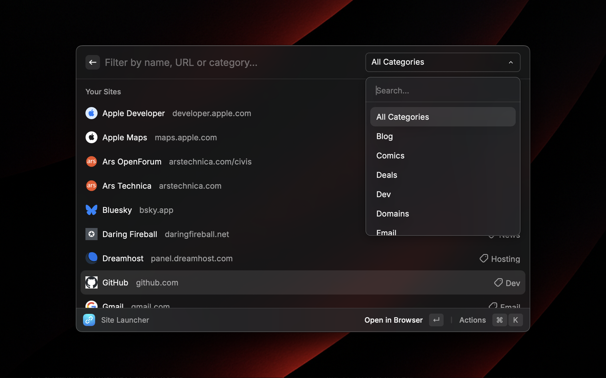
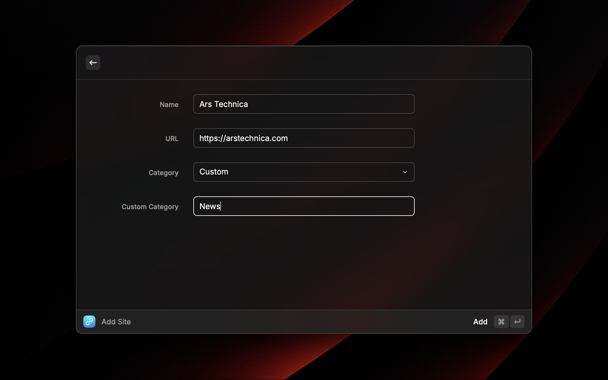
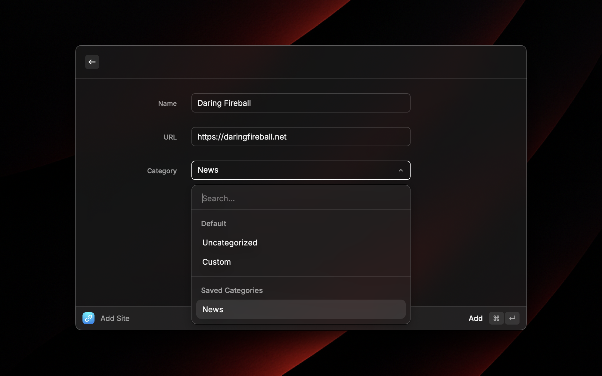
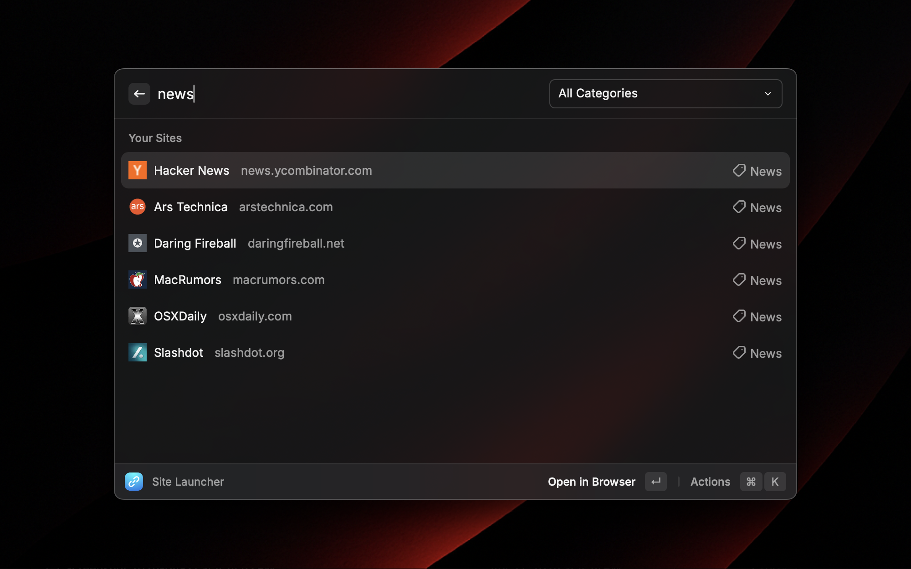

# Daily Sites - Site Launcher

## Description

Daily Sites lets you collect frequently used websites, filter them by name, URL, and category, and easily open them in your default web browser.

## Setup

The first time you open the extension you will be asked to choose an XML folder, this defaults to your Documents folder. This folder is used by the “Export Sites” and “Import Sites” commands. It’s where exported XML files are saved and the default import directory.

## Features

### Site Launcher
- Browse your full collection of saved sites  
- Filter by name, URL or category  
- Open any site in your default web browser  
- **Manage Sites** entry provides:
  - Add Site  
  - Import Sites  
  - Export Sites  
  - Delete All Sites

### Add Site
- Add a new website to your collection  
- Require only a name and URL (category optional)

### Export Sites
- Export your entire collection to an XML file  
- Use for backups or manual editing outside Raycast

### Import Sites
- Import sites from a previously exported XML file  
- Automatically merge only new entries (skips duplicates)

## Usage

As the name implies, Daily Sites was created to make it easier for you to access websites that you view on a daily basis. A prime example of this is technology news sites which may be updated multiple times a day.

We can create a series of sites with the category “News” and then every time you want to browse your tech news sites, you can either type “news” or select the “News” category from the Category dropdown menu.

## Author

Developed by Derek William Scott ([@dubsdotla on GitHub](https://github.com/dubsdotla)).

## License

Distributed under the MIT License.
