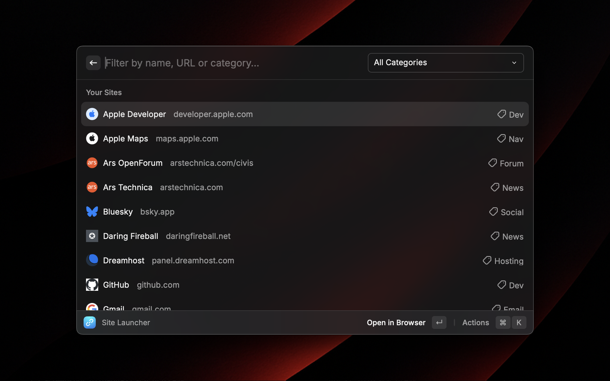
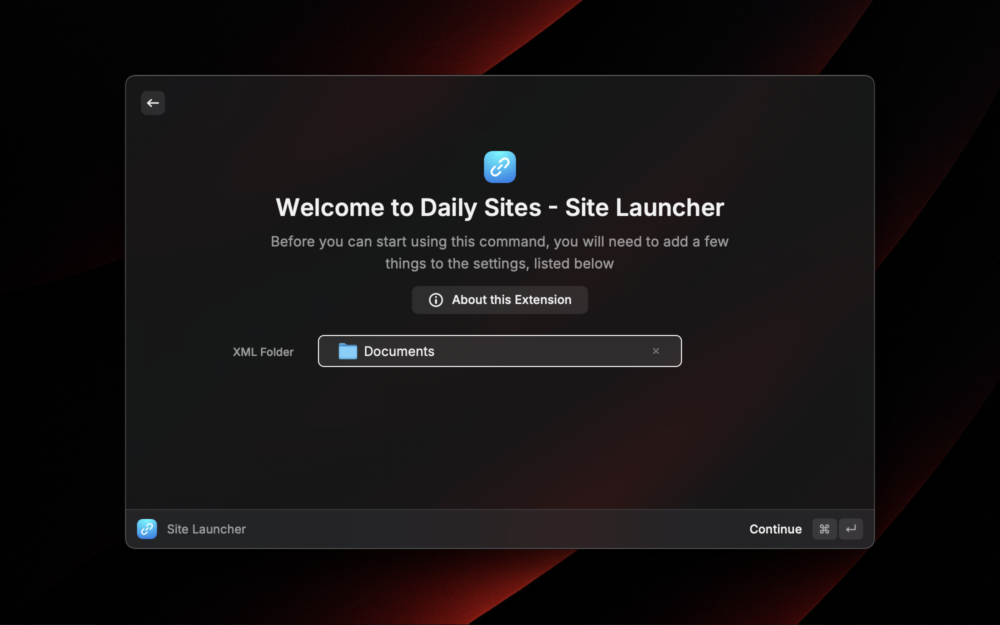

# Daily Sites - Site Launcher

## Description

Daily Sites lets you collect frequently used websites, filter them by name, URL, and category, and easily open them in your default web browser.

## Setup

The first time you open the extension you will be asked to choose an XML folder, this defaults to your Documents folder. This folder is used by the “Export Sites” and “Import Sites” commands. It’s where exported XML files are saved and the default import directory.

## Example Usage

As the name implies, Daily Sites was created to make it easier for you to access websites that you view on a daily basis. A prime example of this is technology news sites which may be updated multiple times a day.

We can create a series of sites with the category “News” and then every time you want to browse your tech news sites, you can either type “news” or select the “News” category from the Category dropdown menu.

## Commands

- **Site Launcher**: Browse your collection of websites. Filter your collection by name, URL, and category. Open sites in your default web browser. Manage your sites via the special “Manage Sites” list entry that provides "Add Site", "Import Sites", "Export Sites" and “Delete All Sites” actions.

- **Add Site**: Add a new website to your collection. A website name and URL are mandatory, while a category is optional.

- **Export Sites**: Export your website collection to an XML file. This can either be utilized solely for backup purposes or enable you to manually add websites to your collection using a text editor of your choice.

- **Import Sites**: Import your website collection from a previously exported XML file. If you have manually added new websites to an XML file, only those new websites will be added to your collection; duplicates will be disregarded.

## Author

Developed by Derek William Scott ([@dubsdotla on GitHub](https://github.com/dubsdotla)).

## License

Distributed under the MIT License.
