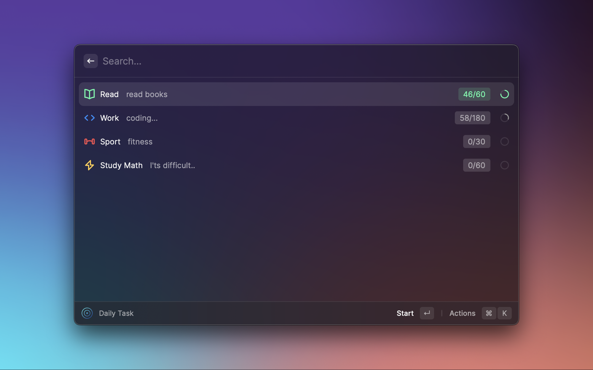
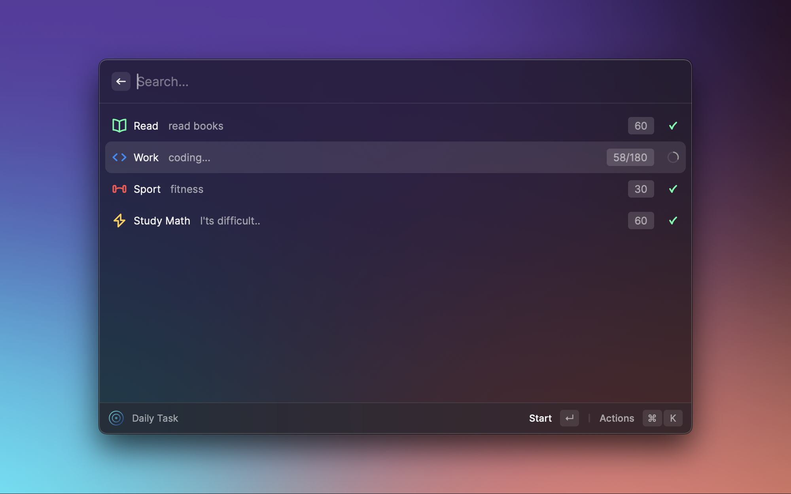
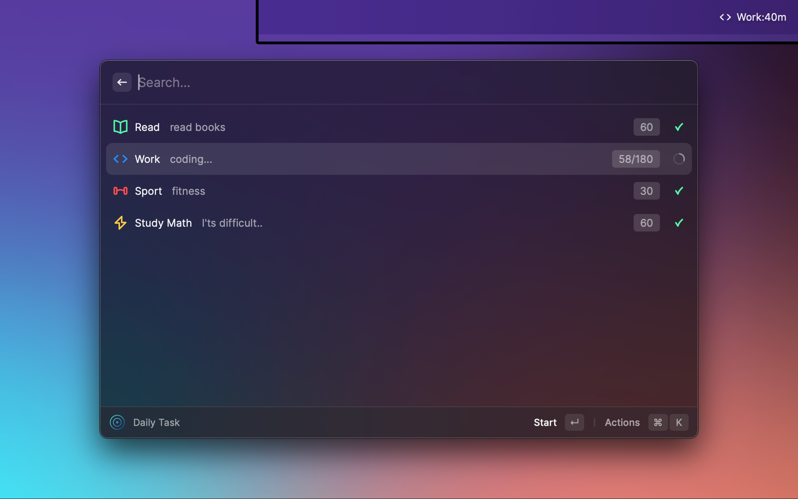
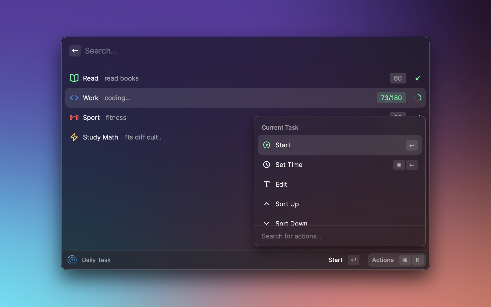

# Daily Task

An extension for manage your Daily Task.

## List

## Complete

## Menubar

## Actions

## Preferences
- Play Completion Sound
- Show Completion Confetti

## Command
- Daily Task
- Show Task Menu Bar
- Pause Activated Task

## Actions
- Task Item Actions
  - Start
  - Set Time: <kbd>⌥</kbd>+<kbd>T</kbd>
  - Edit: <kbd>⌥</kbd>+<kbd>E</kbd>
  - Sort Up: <kbd>⌃</kbd>+<kbd>⌥</kbd>+<kbd>↑</kbd>
  - Sort Down: <kbd>⌃</kbd>+<kbd>⌥</kbd>+<kbd>↓</kbd>
  - Remove: <kbd>⌥+X</kbd>
- More Actions
  - Add: <kbd>⌥</kbd>+<kbd>A</kbd>
  - Reset(reset all task progress to 0): <kbd>⌥</kbd>+<kbd>R</kbd>