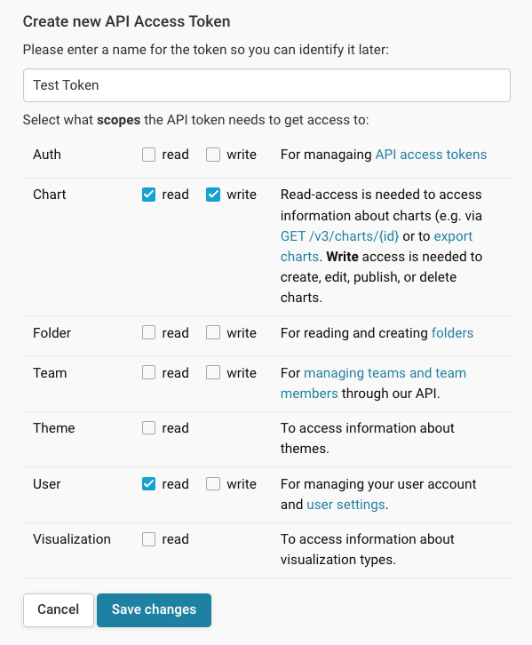

# Datawrapper Raycast Extension

Extension for interacting with [Datawrapper](https://www.datawrapper.de/), a web-based tool for creating interactive charts and maps. Commonly used by journalists, researchers, and organizations to visualize data in an engaging and professional way.

## Features

- Display and search all charts; order by recently edited, published, and created; filter by author, folder, or team (see [command configuration](#search-charts-command-configuration)).
- View your recently edited or published charts.
- Open the new chart creation workflow for a chart, map or table.
- Open the Datawrapper Academy (product documentation) in the browser with optional search query.
- List documentation of "parser" functions for tooltips (reads in the [function list found on GitHub](https://github.com/datawrapper/datawrapper/blob/main/libs/chart-core/docs/parser.md))

## Extension Configuration and API Permissions

This extension requires an [API token from Datawrapper](https://app.datawrapper.de/account/api-tokens) to run.

The `View Recent Charts` and `Search Charts` commands require an API token with `chart:read` permissions to show charts within Raycast. `View Recent Charts` requires both `chart:read` and `user:read` to show the active user's recent charts. More API documentation can be found [here](https://developer.datawrapper.de/docs/getting-started).

### Duplicating Charts

The `Duplicate Chart` action (found within both commands and accessible via hotkey `cmd+D`) requires `chart:write` permissions to duplicate a chart. If you do not have this scope added to the active API key, the action will present an error.

If you'd like to take full advantage of this extension's features, you should configure the API token with the following scopes:

### `Search Charts` Command Configuration

The `Search Charts` command allows filtering chart results by chart author, Datawrapper folder, and/or user team. These optional filters are available in this command's configuration. This is useful if you work within a large team and you'd like to filter results to be more relevant to you. Below is a guide on how to find these IDs:

- **Filter results to author ID (numeric)**: Inspect the rendered chart page and search for "authorId" in the page source. In the large JSON configuration object, there will be a numeric value (ie: `123456`).
- **Filter results to folder ID (numeric)**: Navigate to the folder page in the Datwrapper interface. The folder ID can be found at the end of the URL (ie: `https://app.datawrapper.de/archive/123456` or `https://app.datawrapper.de/archive/team/teamid/123456`).
- **Filter results to team ID (string)**: Navigate to the team page in the Datwrapper interface. The team ID can be found at the end of the URL (ie: `https://app.datawrapper.de/archive/team/12AB123a`)
