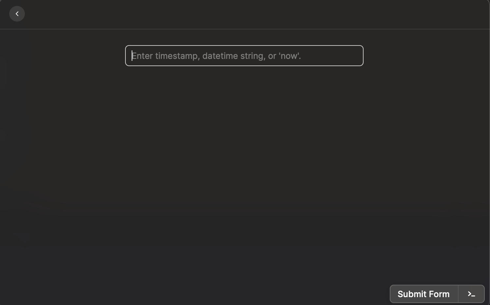
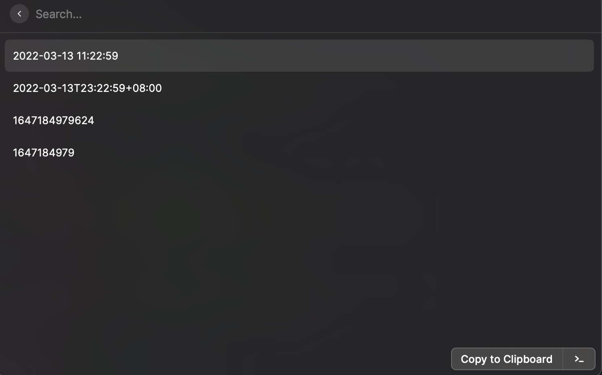

# Datetime Format Converter

A good idea from Alfred workflow of the same name.

## Steps

First, input any time fomat string.

Second, Keydown the "command + enter" to submit.

Finally, choose the string which you want.

## Welcome

Welcome to tell me more formats you like.
