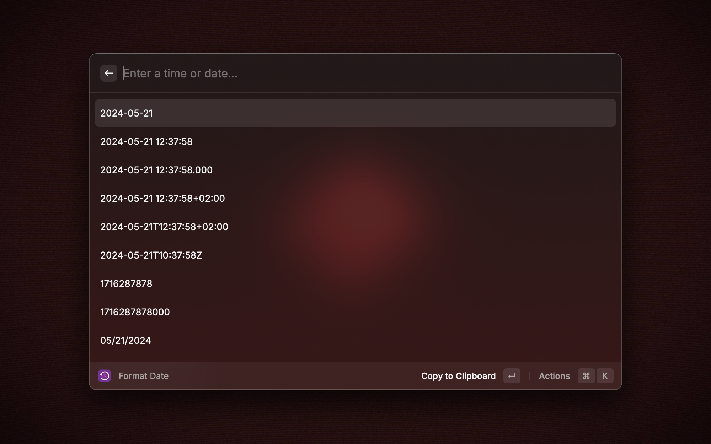
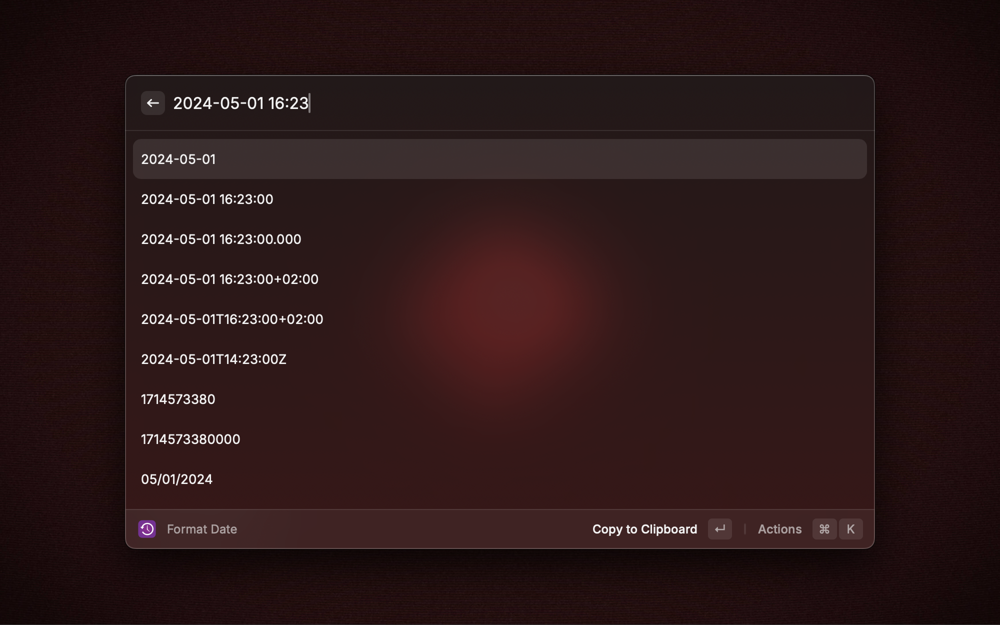

# Datetime Format Converter

A good idea from Alfred workflow of the same name.

## Steps

input any time fomat string.

choose the string which you want.

## Welcome

Welcome to tell me more formats you like.
