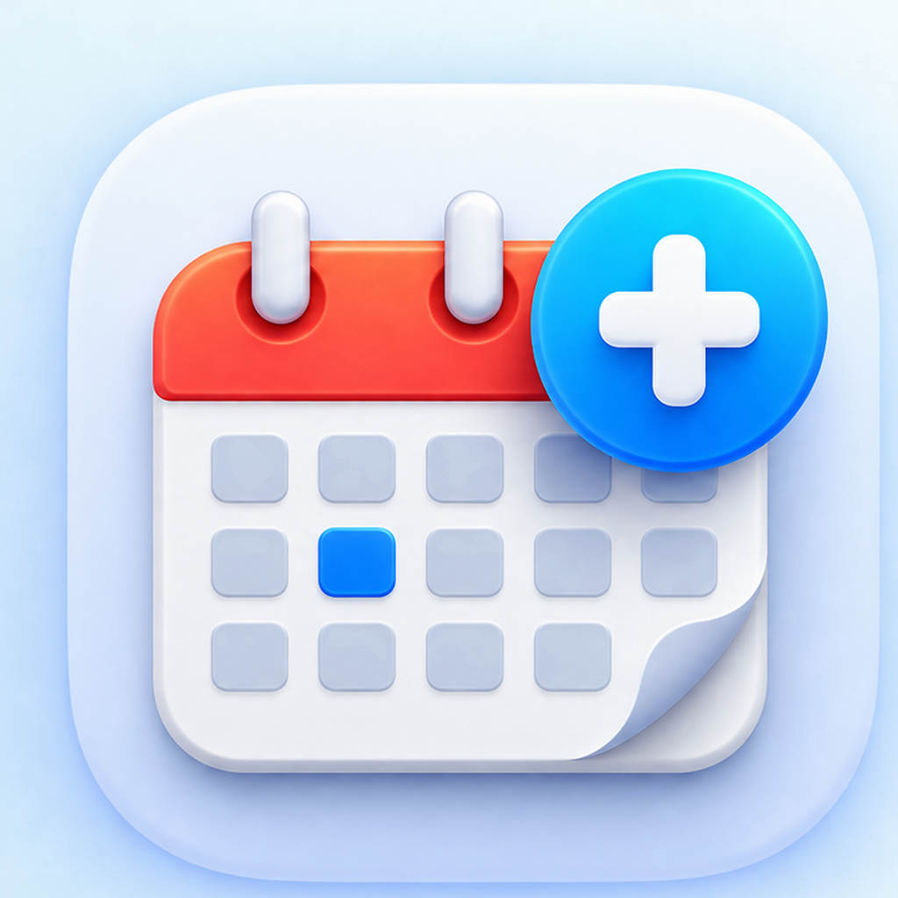

# DayCal

<p align="center">
  
</p>

**DayCal** is a Google Calendar extension for [Raycast](https://www.raycast.com/) with a fast Schedule view, a persistent menu-bar calendar, natural-language Quick Add, event editing, calendar routing, and account-aware setup.

**Website:** [daycal.co.uk](https://daycal.co.uk/)

**Privacy:** [Privacy Policy](PRIVACY.md)

**Support:** [support@daycal.co.uk](mailto:support@daycal.co.uk)

## Highlights

- **Schedule** — browse upcoming Google Calendar events without Apple Calendar.
- **Menu Bar** — keep current and upcoming events one click away.
- **Quick Add** — create Personal, Work, and Shared / Partner events with compact natural-language input.
- **Event management** — edit, move, copy, delete, join meetings, and open locations when permissions allow.
- **True all-day events** — create and edit Google all-day events without converting them into fake midnight events.
- **Independent calendar sets** — choose different calendars for Schedule and the Menu Bar.
- **Guided setup** — map Personal, Work, Shared / Partner, and Family roles after signing in.
- **Multiple Google accounts** — role mappings and calendar selections stay scoped to the connected account.
- **Native Google sign-in** — connect through Raycast without downloaded client-secret files or Terminal helpers.
- **Smart Status** — the menu-bar headline describes the events DayCal is currently showing without claiming visibility into calendars you excluded.

DayCal reads and writes Google Calendar directly. **Apple Calendar is not used.**

## Getting started

Open **Schedule** or **Calendar Menu Bar**. On first use:

1. Sign in to Google through Raycast.
2. DayCal opens **Set up Calendars** if setup is incomplete.
3. Choose calendar roles and the calendars you want to use in Schedule and the Menu Bar.

Automatic/background Menu Bar launches stay quiet when setup is incomplete. The menu includes a **Set up Calendars** action so you can finish setup when convenient.

## Commands

| Command | Purpose |
| --- | --- |
| **Schedule** | View and manage upcoming events |
| **Calendar Menu Bar** | Show current/upcoming events in the macOS menu bar |
| **Enabled Calendars** | Choose independent Schedule and Menu Bar calendar sets |
| **Calendar Settings** | Configure filtering, event count, date format, and row layout |
| **Set up Calendars** | Assign Personal, Work, Shared / Partner, and Family roles |
| **Add Personal Event** | Quick Add to the Personal role |
| **Add Work Event** | Quick Add to the Work role |
| **Add Shared Event** | Quick Add to the Shared / Partner role |
| **Disconnect Google Account** | Sign out locally and choose whether to keep or delete that account's saved DayCal setup |

## Suggested hotkeys

These are optional Raycast hotkeys:

| Command | Suggested hotkey |
| --- | --- |
| Schedule | `⌃⌥S` |
| Add Personal Event | `⌃⌥P` |
| Add Work Event | `⌃⌥W` |
| Add Shared Event | `⌃⌥J` |

Configure them in **Raycast Settings → Extensions → DayCal - Google Calendar**.

## Quick Add examples

```text
tomorrow 7pm
Friday 12pm
next Friday
15/09 7pm
45m @ Home
Friday 3d
Zoom
https://example.com/meeting
```

DayCal supports UK (`DD/MM/YYYY`) and US (`MM/DD/YYYY`) date modes from Calendar Settings.

## Opening events and calendars

**Open Event / Open in Google Calendar** opens the exact event in your default browser for the connected Google account, including secondary accounts, from Schedule, Next Up, Edit Event, and the Menu Bar. Sign in to that account in your browser if prompted. If Google supplies no event link, DayCal opens the event day instead.

**Open Calendar** in the Menu Bar also uses your default browser and opens the calendar view for the currently connected Google account.

## Event permissions

DayCal deliberately treats owned events and invitations differently.

Owned events can expose actions such as Edit, Move, and Delete. Guest/invited events use safer actions such as Copy to Calendar and do not receive destructive owner-style actions where Google does not indicate ownership.

In the Menu Bar event submenu, ordinary writable one-off events keep **Move to Calendar…** where supported. Ordinary writable recurring events offer **Copy to Calendar…** instead. Existing **Join Meeting** and **Open Location** shortcuts take precedence when present. Read-only, guest, and special events expose only their supported actions.

## Privacy and authentication

See the full [Privacy Policy](PRIVACY.md).

DayCal uses Raycast's native Google OAuth support and requests:

- `calendar.events` — read and manage calendar events;
- `calendar.calendarlist.readonly` — read the user's calendar list, colours, and access roles.

OAuth tokens are managed by Raycast. The extension contains the OAuth **client ID**, which is public by design, but contains no client secret, refresh token, or access token.

DayCal stores extension preferences and account-scoped calendar configuration locally through Raycast. The persistent Menu Bar also uses a local Raycast cache of upcoming event data so it can render quickly without contacting Google on every click. DayCal does not operate a backend server that receives this calendar data.

DayCal does not use calendar data for advertising, tracking, analytics, data brokerage, or training generalized AI/ML models.

## Known limitations

- Raycast's native DatePicker free-text suggestion parser can reject or inconsistently interpret some abbreviated phrases. DayCal validates Start/End relationships and preserves event duration when Start moves past End, but does not replace Raycast's DatePicker parser.
- Timed events and all-day events can both be edited in Raycast, but DayCal does not currently convert timed events into all-day events or vice versa.
- Moving recurring events is not supported; use **Copy to Calendar…** where offered.
- DayCal is currently macOS-only.

## License

MIT
