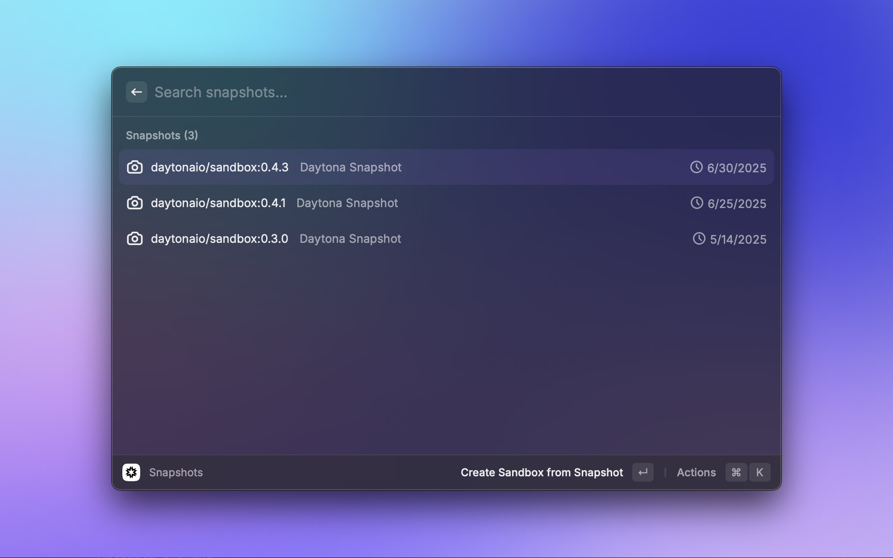
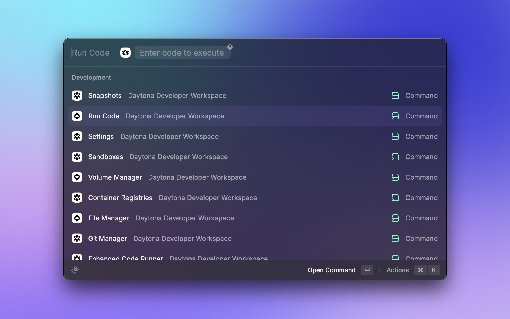
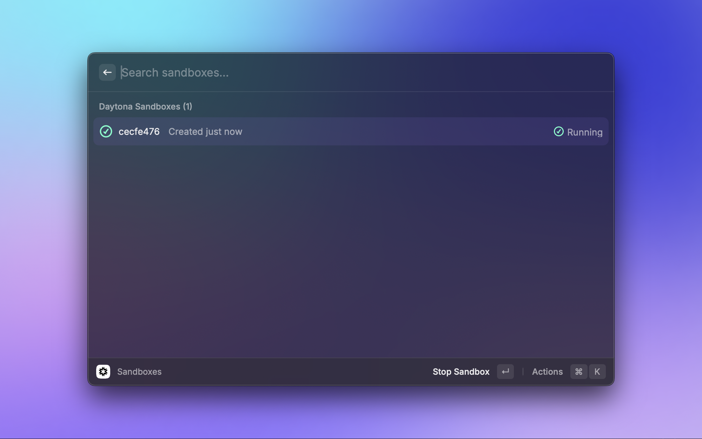
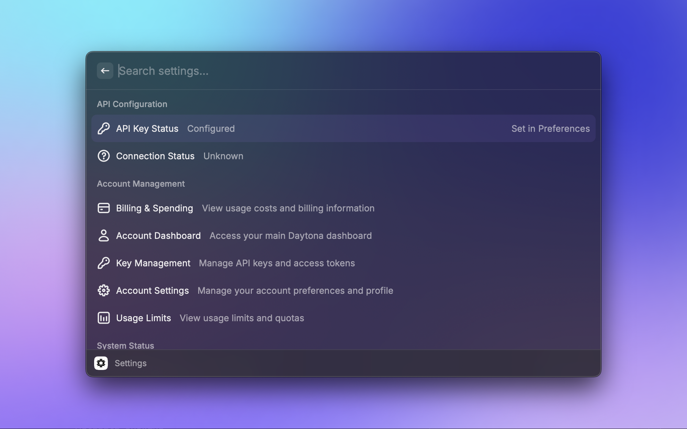
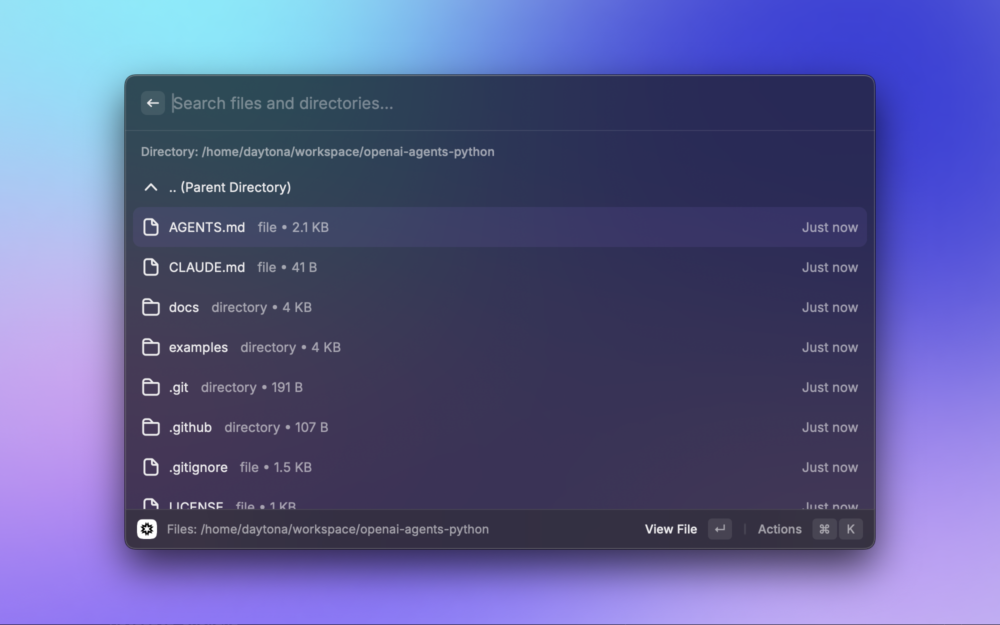
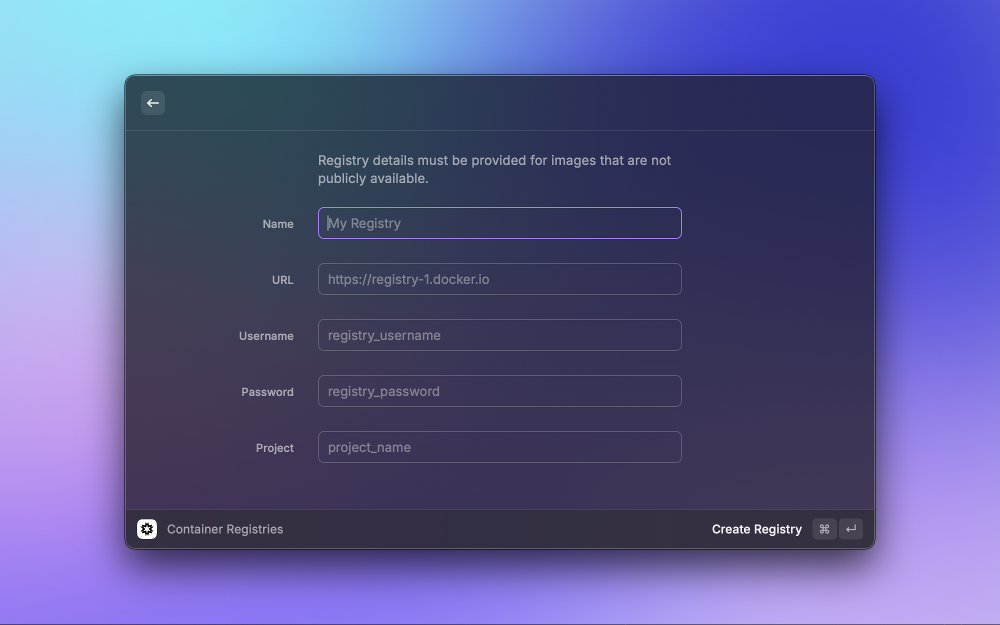
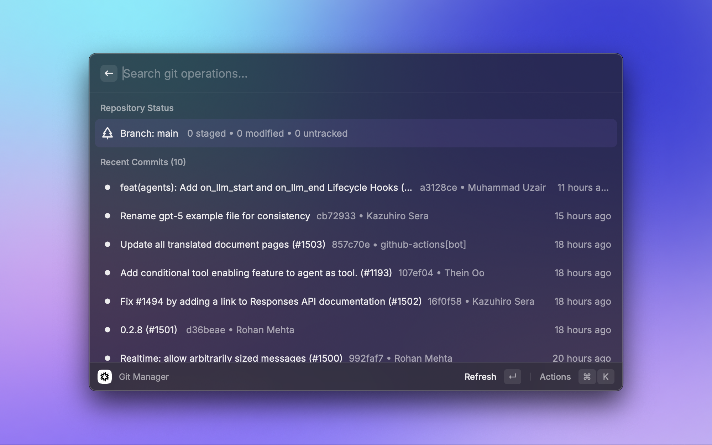
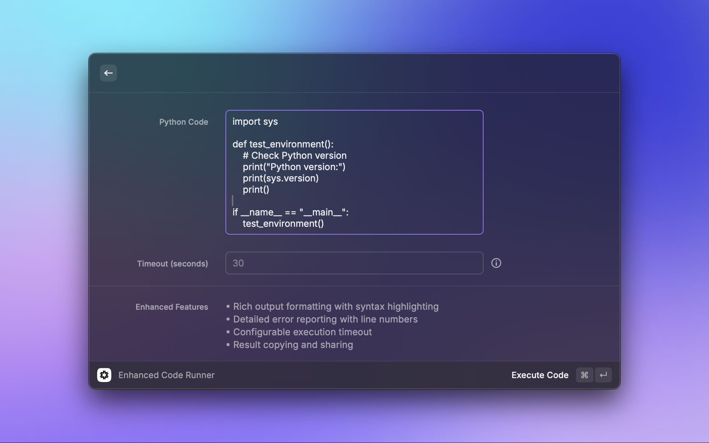

# Daytona Developer Workspace Raycast Extension

A Raycast extension for managing Daytona sandboxes with code execution, file management, Git operations, workspace control, AI-powered code generation and on-the-fly execution, persistent storage, snapshots, and management of settings.

## Installation

1. Install Raycast from [raycast.com](https://www.raycast.com/)
2. Clone this repository and build locally (not yet published to Raycast Store)
3. Configure your Daytona API key in extension preferences

## Screenshots









## Commands

### Sandboxes
View and manage your sandboxes with overview and quick actions. Create, start, stop, delete sandboxes and open web terminal

### Run Code
Execute Python code in a Jupyter notebook cell and return results.

### Enhanced Code Runner
Advanced code execution with persistent sandboxes and rich output.

### File Manager
Browse, edit, and manage files in your sandboxes.

### Git Manager
Git operations and repository management for workspace projects.

### Snapshots
Create, restore, and manage workspace snapshots and backups.

### Settings
Configure preferences, API keys, and extension settings.

### Volumes
Create, attach, detach, and manage persistent storage volumes for your sandboxes.


## Development

```bash
npm install      # Install dependencies
npm run dev      # Start development with live reload
npm run build    # Build for production
npm run lint     # Check code quality
npm run fix-lint # Auto-fix linting issues
```


## Security

Code executes in secure Daytona sandboxes with resource limits and isolation from the host system.

## Contributing

Contributions welcome. Follow the existing code style and run linting before submitting.

## License

MIT License