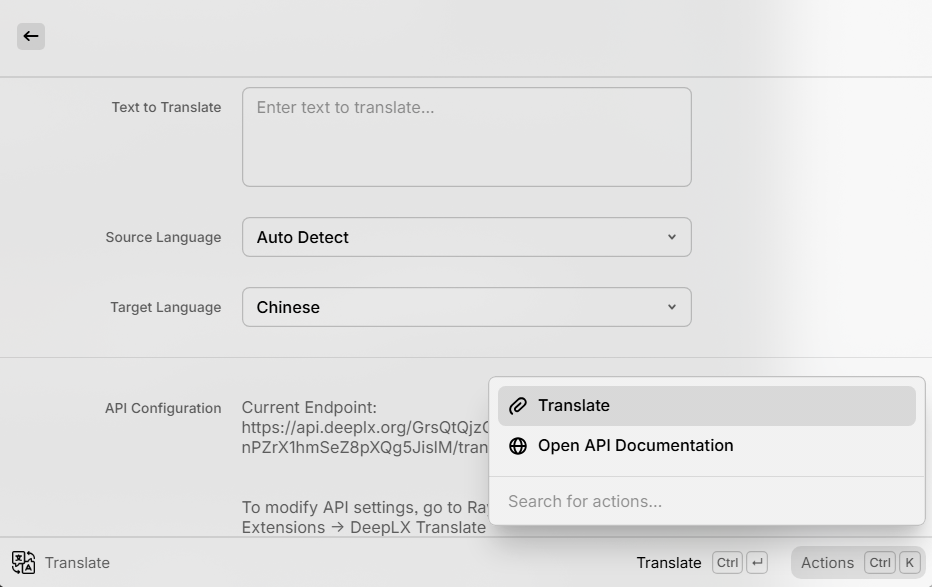
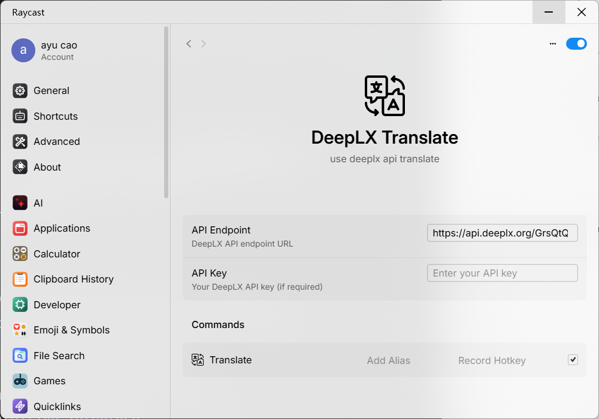

# DeepLX Translate - Raycast Extension


A Raycast extension that provides translation functionality using the DeepLX API.

## Screenshots




## Features

- 🏃‍♂️ Fast and easy translation directly from Raycast
- 🌐 Supports multiple languages (Auto-detect, Chinese, English, Japanese, French, German, etc.)
- ⚙️ Customizable API endpoint and API key
- 💾 Translation history and copy to clipboard
- 🔄 **Smart alternative translations display** - View multiple translation suggestions on one page
- 🎯 Simple and intuitive interface

## Installation

1. Install the extension from the [Raycast Store](https://www.raycast.com/) or build it locally:
   ```bash
   npm install
   npm run build
   ```

## Configuration

Before using the extension, you need to configure your DeepLX API settings:

1. Open Raycast and type "Translate" to open the extension
2. Press `⌘ + ,` to open Raycast Settings
3. Navigate to Extensions → DeepLX Translate
4. Configure the following settings:

- **API Endpoint**: The DeepLX API endpoint URL (default: `https://api.deeplx.org/translate`)
- **API Key**: Your API key if required by your DeepLX instance
- **Show Alternative Translations**: Toggle to display alternative translation suggestions

## Usage

1. Open Raycast (default: `⌘ + Space`)
2. Type "Translate" and press Enter
3. In the translation form:
   - Enter the text you want to translate in the text area
   - Select the source language (default: Auto Detect)
   - Select the target language (default: English)
   - Press Enter or click "Translate" to perform the translation

### Keyboard Shortcuts

- `Enter`: Perform translation
- `⌘ + D`: Open API documentation
- `⌘ + C`: Copy translation result
- `⌘ + ,`: Open extension settings

### Alternative Translations Feature

The extension now supports displaying alternative translations directly in the detail view:

- **Automatic display**: Alternative translations are shown when available from the API
- **Clean layout**: Main translation is prominently displayed at the top
- **Easy comparison**: Multiple alternatives are listed numerically for easy comparison
- **Configurable**: Can be disabled in settings if not needed
- **Bilingual support**: Automatically translates to both English and Chinese

When viewing translation results:

1. Press `Enter` on any translation to view details
2. The main translation appears at the top
3. Alternative translations are listed below (up to 5 shown, with count display)

## Supported Languages

- Auto Detect
- Chinese (ZH)
- English (EN)
- Japanese (JA)
- French (FR)
- German (DE)
- Spanish (ES)
- Italian (IT)
- Russian (RU)
- Portuguese (PT)
- Korean (KO)
- Arabic (AR)

## Development

### Prerequisites

- Node.js 18+
- Raycast CLI

### Commands

- `npm run dev` - Start development server with hot reload
- `npm run build` - Build for production
- `npm run lint` - Run ESLint
- `npm run fix-lint` - Fix linting issues
- `npm run publish` - Publish to Raycast Store

### Project Structure

```
src/
  translate.tsx    # Main translation component
assets/
  extension-icon.png
```

## API Reference

This extension uses the DeepLX API. For more information about the API, visit:

- [DeepLX GitHub Repository](https://github.com/OwO-Network/DeepLX)
- [API Documentation](https://github.com/OwO-Network/DeepLX#api-usage)

## Troubleshooting

### Common Issues

1. **Translation fails with connection error**
   - Check your internet connection
   - Verify the API endpoint URL in settings

2. **API returns error**
   - Check if your API key is valid (if required)
   - Ensure the API endpoint is accessible

3. **Extension not loading**
   - Run `npm run build` to rebuild the extension
   - Restart Raycast

## License

MIT © [ayu_cao](https://github.com/ayu_cao)

## Contributing

Feel free to submit issues and pull requests to improve this extension.
