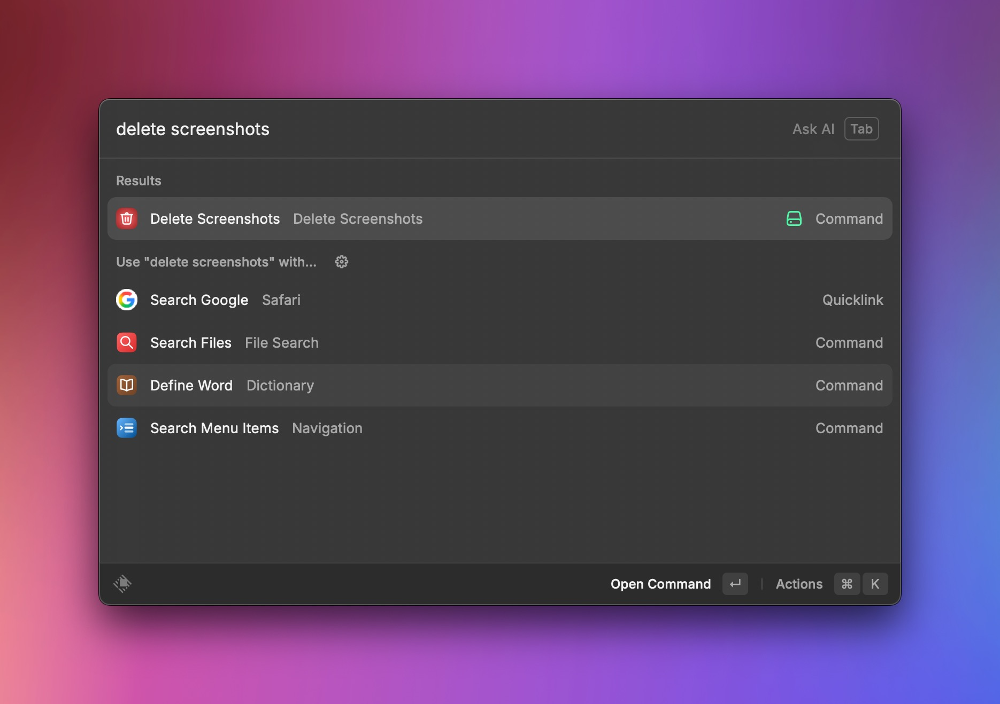

# 🧹 Delete Screenshots – Raycast Extension

A simple but powerful Raycast extension to help you clean up screenshots from your system quickly and safely.  
Files are moved to the Trash (not permanently deleted), so you can recover them if needed.

---

## 🔧 Features

- ✅ Deletes screenshots from one or more folders
- ✅ Filters files by keywords in the filename (e.g., "Screenshot")
- ✅ Filters by file extensions (e.g., `.jpg`, `.jpeg`, `.png`)
- ✅ Optional confirmation before deletion
- ✅ Moves files to Trash

---

## ⚙️ Preferences

You can customize the behavior in Raycast’s "Configure Command" menu:

| Setting             | Description                                                           | Default      |
| ------------------- | --------------------------------------------------------------------- | ------------ |
| `Folders`           | Comma-separated folder paths to search                                | `~/Desktop`  |
| `Keywords`          | Words the filename should contain (case-insensitive, comma-separated) | `Screenshot` |
| `Extensions`        | File extensions to include (comma-separated, without `.`)             | `jpg,jpeg`   |
| `Ask Before Delete` | Whether to show a confirmation dialog before deletion                 | ✅ (Enabled) |

---

## 💡 Example Use Cases

- Quickly clear up screenshots from your desktop.
- Set up a Downloads subfolder as a screenshot dump and clean it regularly.
- Use it with different keyword combos like `Screen Shot`, `Snip`, or `ss-`.
