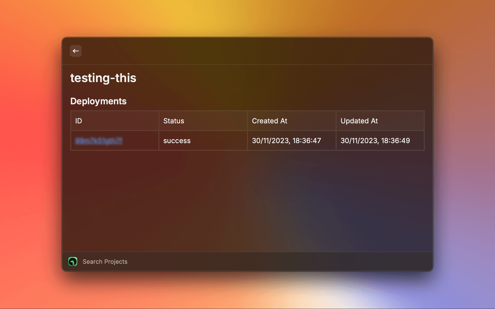
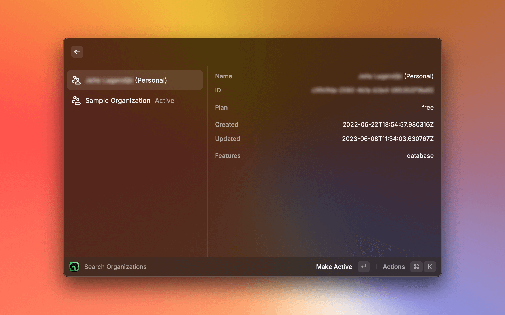
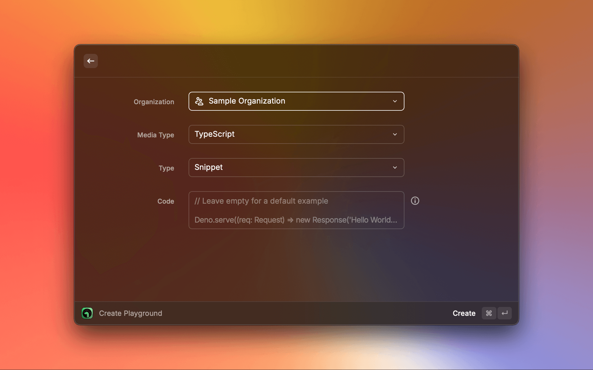
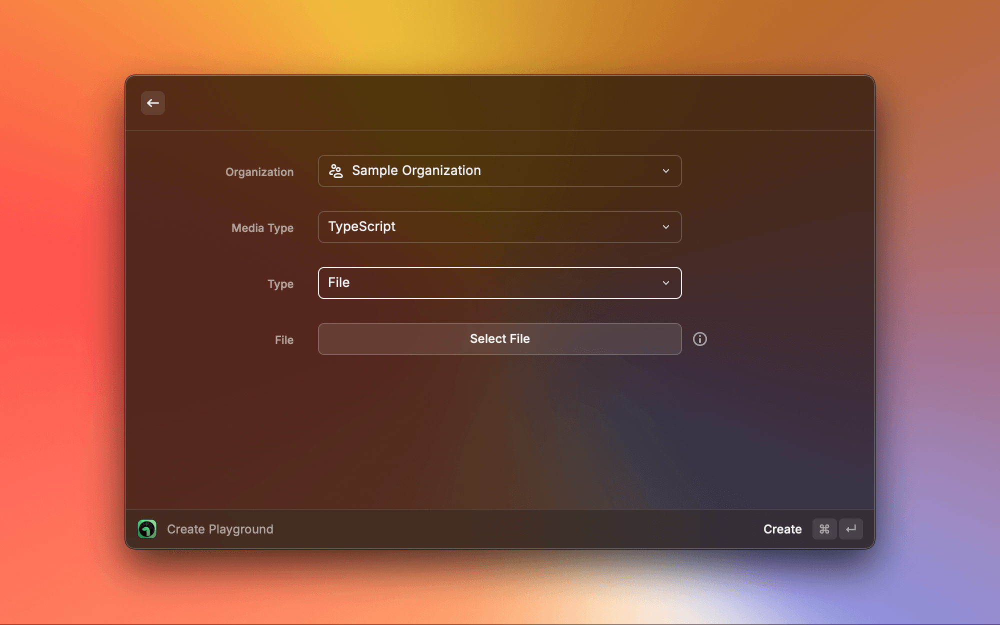

# Deno Deploy

View and modify your [Deno Deploy](https://deno.com/deploy) projects.

> This extension is not affiliated with [Deno](https://deno.com/) or [Deno Deploy](https://deno.com/deploy).

## Setup

- You need to add an access token in the extension settings. You can get one from [https://dash.deno.com/account#access-tokens](https://dash.deno.com/account).

## Features

- View your organizations
- View your projects per organization
- Rename a project
- Delete a project
- Create a new [Playground](https://docs.deno.com/deploy/manual/playgrounds) (Typescript)
- Create a new [Playground](https://docs.deno.com/deploy/manual/playgrounds) from a snippet or file

## Roadmap

- Create a new project from a folder
- Manage [KV databases](https://docs.deno.com/deploy/kv/manual/)

## Contributing

Feel free to open an issue or a pull request. I'm using the official [Deno Deploy API](https://docs.deno.com/deploy/api/rest/) as well as the undocumented Dash API.

## Screenshots

