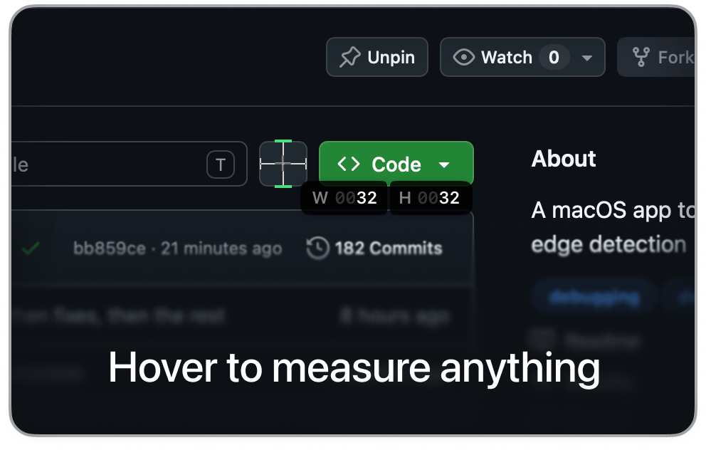
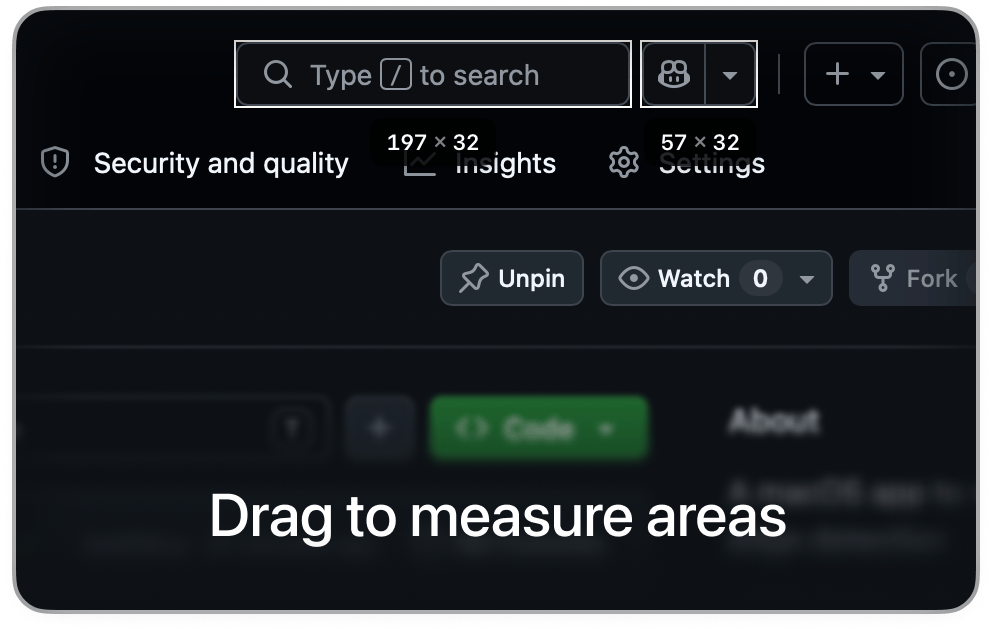
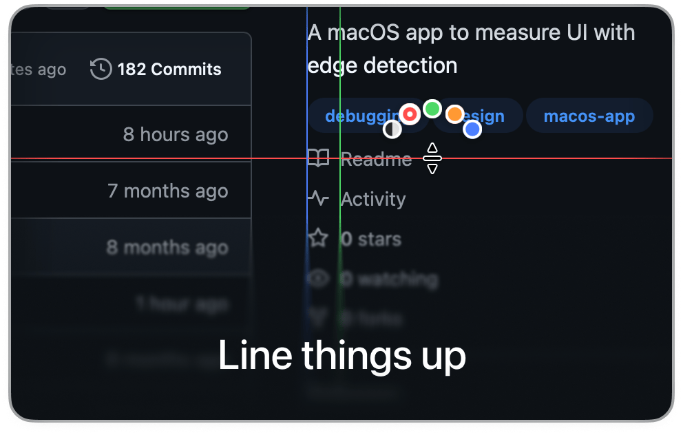
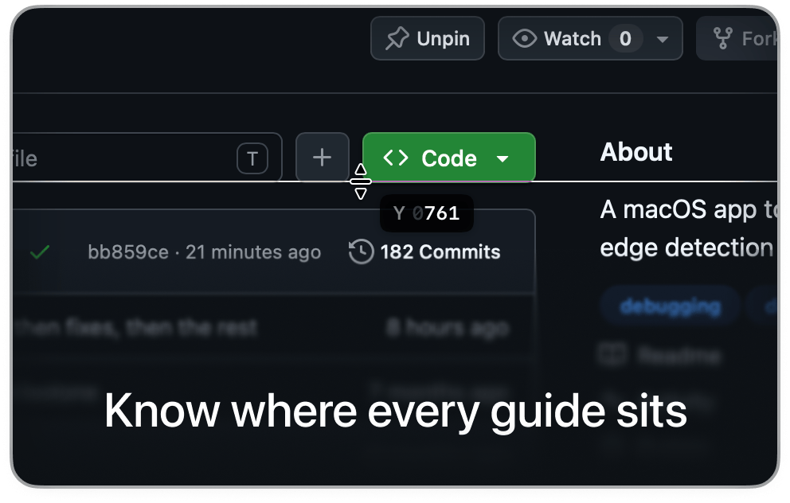

# Design Ruler

Measure UI with edge detection and place guides to check alignment. Both commands freeze the screen in a fullscreen overlay, work across all your monitors, and zoom to 4x with **Z**.

## Setup

Design Ruler reads the screen, so Raycast needs the Screen Recording permission:

1. Run **Measure** or **Alignment Guides**. macOS asks whether Raycast can record the screen.
2. Turn on Raycast in **System Settings → Privacy & Security → Screen Recording**. If macOS offers to quit and reopen Raycast, let it.

Until then, the commands show a message pointing to that setting instead of the overlay.

##  Measure

Hover anything to see the distance to its edges in all four directions, with a live W × H. Drag to measure an area: the selection snaps to the edges it finds.

  
  

| Key | Action |
|---|---|
| Arrow keys | Skip to the next edge in that direction |
| Shift + Arrow | Bring the edge back |
| Drag | Measure an area (snaps to edges) |
| Click a selection | Remove it |
| Z | Zoom 1x → 2x → 4x |
| Esc | Exit |

##  Alignment Guides

Click to place vertical or horizontal guides. Each one shows its exact X or Y position while you place it.

  
  

| Key | Action |
|---|---|
| Click | Place a guide |
| Click a guide | Remove it |
| Tab | Switch between vertical and horizontal |
| Space | Change the color (Dynamic, red, green, orange, blue) |
| Z | Zoom 1x → 2x → 4x |
| Esc | Exit |

## Preferences

| Preference | Command | Default | |
|---|---|---|---|
| Show Hint Bar | Both | On | The keyboard shortcuts at the bottom of the overlay |
| Count 1px Borders | Measure | Smart | Whether 1px borders count in measurements. Smart counts them or not, whichever fits the 4px grid; a green tick marks an edge whose border was counted |
| Remember Color and Direction | Alignment Guides | Off | Start with the color and direction you used last, instead of Dynamic and vertical |

## Also a menu bar app

Design Ruler is also a standalone macOS app with global keyboard shortcuts, from [GitHub](https://github.com/haythemgataa/design-ruler).
