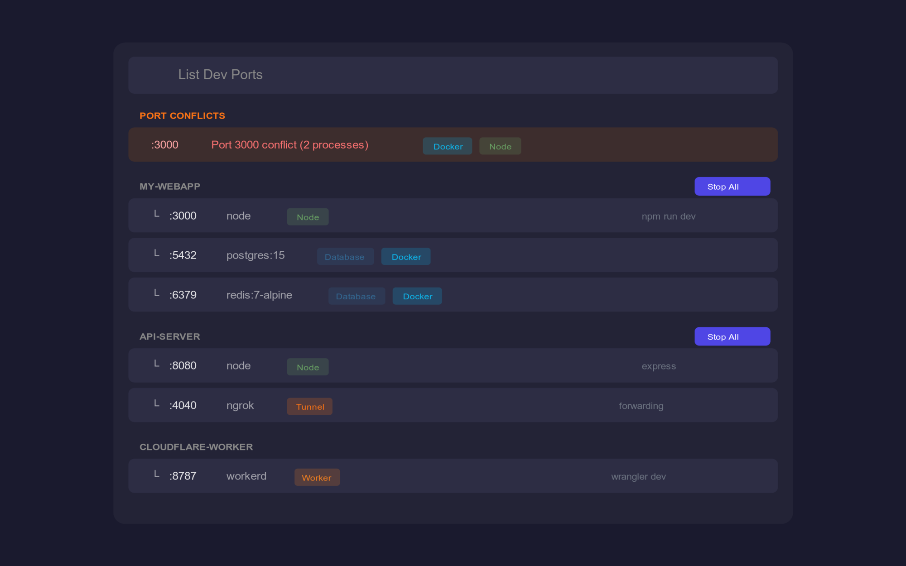

# Dev Port Manager

A Raycast extension to manage development server processes and Docker containers.

## Features

- **List Running Ports**: View all development servers and Docker containers in one place
- **Project Grouping**: Processes are grouped by project (detected via `.git` directory)
- **Port Conflict Detection**: Automatically detects and highlights port conflicts
- **Smart Categorization**: Identifies process types (Database, Node, Worker, Browser, etc.)
- **Bulk Actions**: Stop all processes in a project with one click
- **Docker Support**: Works with Colima, Docker Desktop, Podman, and Rancher Desktop

## Screenshots



## Installation

Install from the [Raycast Store](https://raycast.com/agent-y/dev-port-manager) or:

```bash
git clone https://github.com/agent-Y/dev-port-manager.git
cd dev-port-manager
npm install
npm run dev
```

## Usage

1. Open Raycast and search for "List Dev Ports"
2. View all running development servers and Docker containers
3. Press Enter to stop a process/container
4. Use `⌘⇧P` to stop all processes in a project

## Preferences

- **Ignored Processes**: Comma-separated list of process names to ignore
- **Custom Docker Socket Path**: Override the auto-detected Docker socket path

## Supported Docker Runtimes

- Colima (`~/.colima/default/docker.sock`)
- Docker Desktop (`~/.docker/run/docker.sock`)
- Podman (`~/.local/share/containers/podman/podman.sock`)
- Rancher Desktop (`~/.rd/docker.sock`)
- Standard Linux (`/var/run/docker.sock`)

## Process Categories

| Category | Detected By |
|----------|-------------|
| Database | postgres, mysql, redis, mongo |
| Worker | workerd, wrangler (Cloudflare) |
| Node | node, deno, bun |
| Browser | Chrome, Safari, Firefox |
| Tunnel | ngrok, cloudflared |
| Server | nginx, apache, caddy |
| SSH | ssh port forwarding |

## License

MIT
