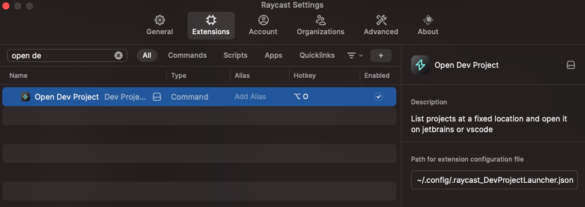
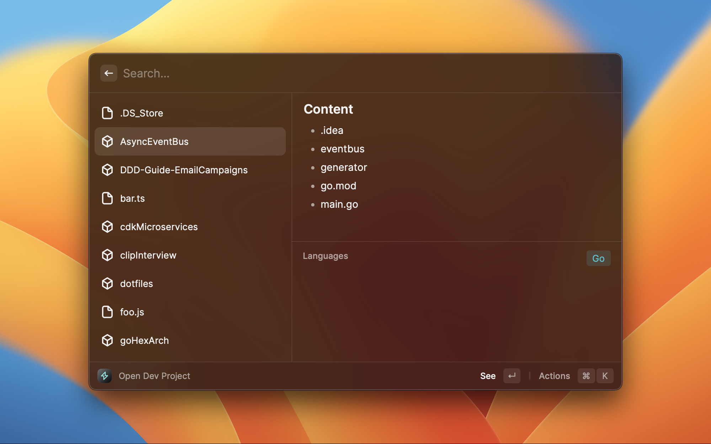
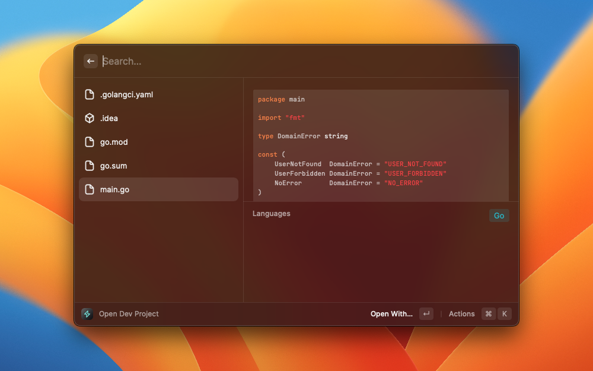
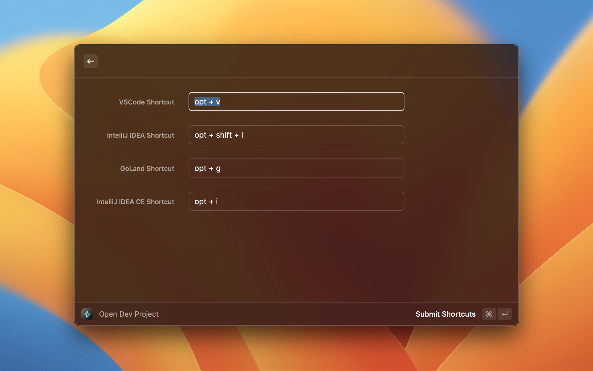
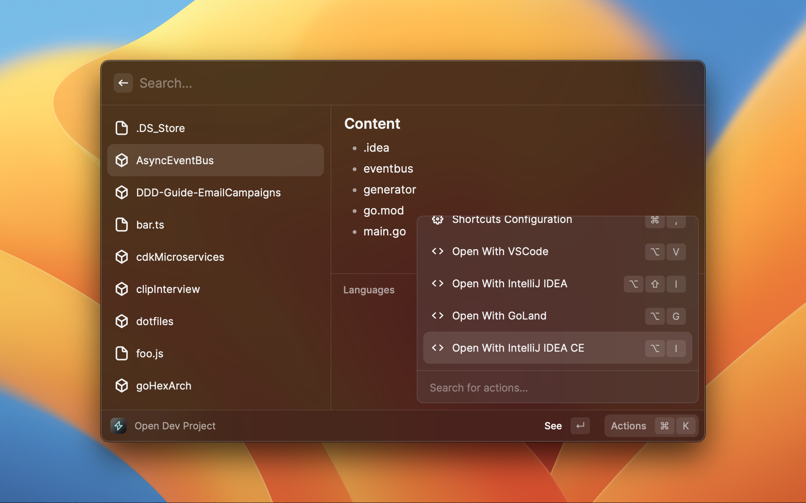

# Dev Project Launcher

😎 List projects, search and open it with any IDE!

## Configuration

The shortcuts will be saved into a configuration file, by default that configuration file will be in `~/.raycast_DevProjectLauncher.json`.
You can change that path after you initialize the extension for the first time and also in the extension preferences.
> **_Advice!🚧🚧🚧:_** Another thing that you should know is that you will probably need to give `Full Disk Access` to Raycast application, only if you want to search files and directories in your home directory.

## Default shortcuts

| Name                       | Shortcut          | Description                                                 |
|----------------------------|-------------------|-------------------------------------------------------------|
| See                        | `enter`           | Enter into the current directory                            |
| Open With                  | `enter`           | Open the current file with an application                   |
| Shortcuts Configuration    | `cmd + ,`         | Open extension shortcuts configuration                      |
| Open With VSCode           | `opt + v`         | Open current file/directory with VSCode                     |
| Open With IntelliJ IDEA    | `opt + i`         | Open current file/directory with IntelliJ                   |
| Open With IntelliJ IDEA CE | `opt + shift + i` | Open current file/directory with IntelliJ Community Edition |
| Open With GoLand           | `opt + g`         | Open current file/directory with Goland                     |

## Features

### Navigate across your projects and See the content of your files 🚶👀

### Customize your shortcuts ⌨️

### Open your file/directory with your favorite IDE ⚡
