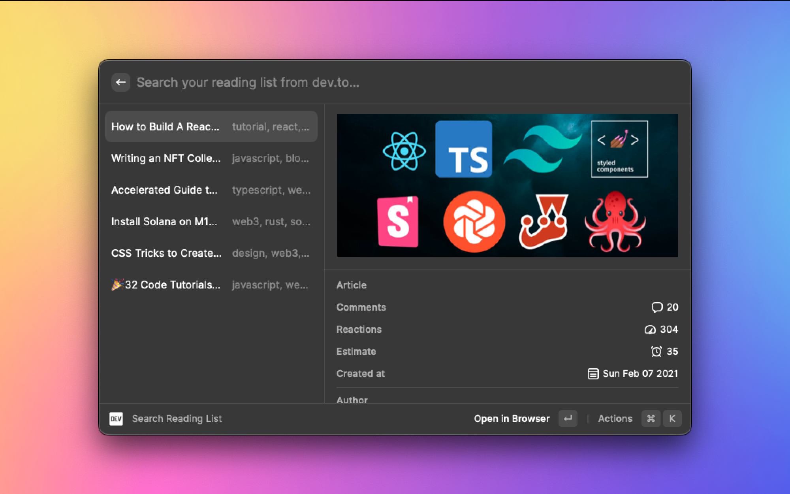
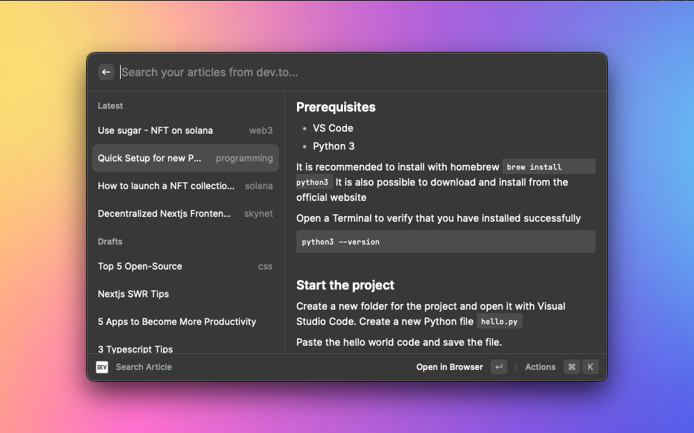
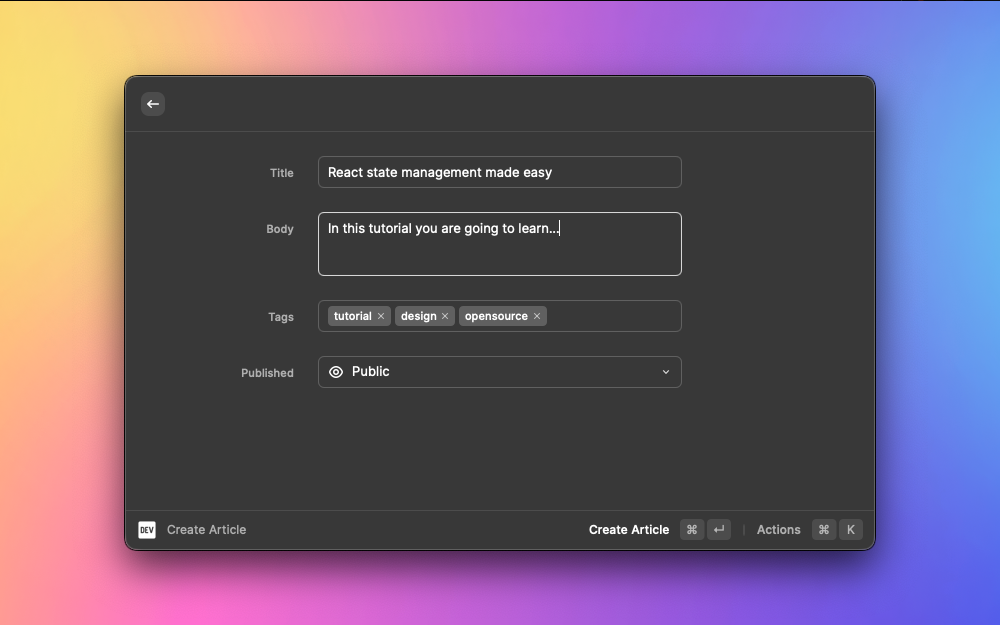

 

<h1 align="center">
  DEV.to for Raycast
</h1>

  Open reading list, create article, and manage articles on <a href="https://dev.to">DEV Community</a> with <a href="https://www.raycast.com">Raycast</a>.

### Getting Started

- Login to your dev.to account
- Go to the DEV Community API Keys section in https://dev.to/settings/extensions.
- Generate your API Key
- Add your access token in the extension settings.

### Commands

- Search Reading List. It is the list of all the articles saved in dev.to.

- Search Articles. Explore and manage all the articles published by you or still in draft.

- Create Article. Start a new article directly from Raycast.

## Changelog

The [changelog](CHANGELOG.md) documents all notable updates to the extension.

## Contributing

See [Contribute to an Extension](https://developers.raycast.com/basics/contribute-to-an-extension) if you're interested in contributing to this extension!

Feel free to open an issue [open an issue with feedback](https://github.com/aeither/extensions/issues)!
