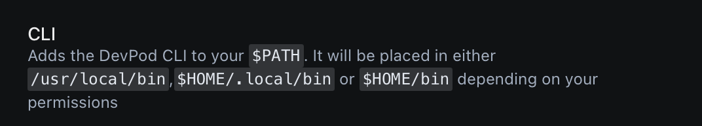

# DevPod for Raycast

Manage your DevPod workspaces directly from Raycast. This extension allows you to list, start, stop, and delete DevPod workspaces without leaving your keyboard.

## Features

- **List Workspaces**: View all your DevPod workspaces with their current status.
- **Create Workspaces**: Easily generate a command to create new workspaces using custom images or choose from a list of third-party images.
- **Manage Workspaces**: Start, stop, and delete workspaces with simple keyboard shortcuts.
- **Workspace Details**: View detailed information about each workspace, including provider, last used date, and creation date.

## Requirements

- [DevPod](https://devpod.sh/) must be installed on your system.
- Verify that `devpod` is available from the command line and you have a default [provider](https://devpod.sh/docs/managing-providers/add-provider) set up.

Devpod will be set in one of 3 locations:

## Installation

1. Ensure DevPod is installed on your system. If not, follow the [official DevPod installation guide](https://devpod.sh/docs/getting-started/install).
2. Install the DevPod extension from the Raycast store.

## Usage

### Listing Workspaces

1. Open Raycast and type "DevPod Workspaces".
2. Press Enter to see a list of all your DevPod workspaces.

### Creating a New Workspace

1. From the workspace list, use the shortcut `Cmd + C` or select "Create New Workspace" from the action panel.
2. Choose between using a custom image path or selecting from third-party images.
3. Follow the prompts to complete workspace creation.

### Managing Workspaces

- **Reload Workspaces**: `Cmd + R` to reload the list of workspaces.
- **Start a Workspace**: Select a stopped workspace and use the shortcut `Cmd + Shift + S` or choose "Start" from the action panel.
- **Stop a Workspace**: Select a running workspace and use the shortcut `Cmd + Shift + S` or choose "Stop" from the action panel.
- **Delete a Workspace**: Use the shortcut `Cmd + Shift + D` or choose "Delete" from the action panel.

### Viewing Workspace Details

Select a workspace and choose "View Details" from the action panel to see comprehensive information about the workspace.

### Reloading the Workspace List

Use the shortcut `Cmd + R` or select "Reload List" from the action panel to refresh the workspace list.

## Troubleshooting

- If workspaces are not appearing, ensure DevPod is correctly installed and accessible in your `~/bin`.
- For any issues with workspace operations, check the DevPod logs or console output for more information.
