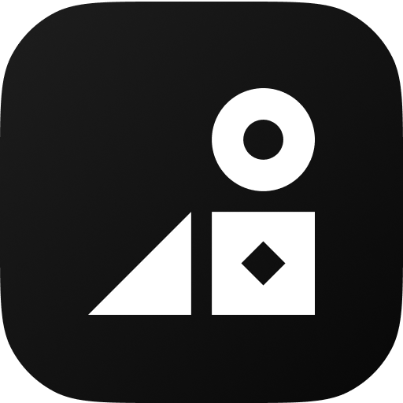

    

<h1 align="center">Dev Tools</h1>

    A collection of developer tools for everyday tasks.
     
    Feel free to contribute and add more tools.

## Convert

- _todo_

## Encode / Decode

- base64: [view in Raycast Store](https://www.raycast.com/DanielSinclair/base64)

## Format

- `Format JSON`: prettry print JSON from clipboard

## Generate

- Lorem Ipsum: [view in Raycast Store](https://www.raycast.com/AntonNiklasson/lorem-ipsum)
- UUID Generator: [view in Raycast Store](https://www.raycast.com/jmaeso/uuid-generator)
