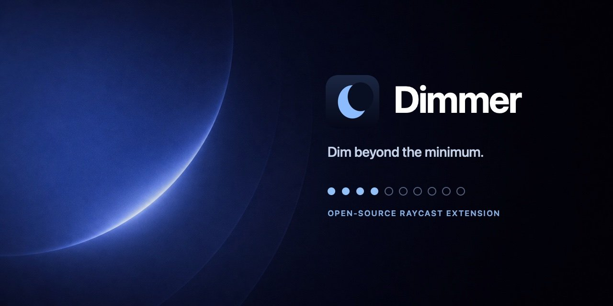

# Dimmer



Dim every Mac display beyond its minimum hardware brightness, directly from Raycast.

Dimmer adds a dark, click-through overlay to each connected display. It does not modify display firmware, gamma tables, or physical brightness. Everything runs locally and no usage data is collected.

## Commands

- **Toggle Dimmer** turns the saved dim level on or off.
- **Dim More** and **Dim Less** adjust the overlay using the configured step.
- **Set Dim Level** selects an exact level from 10–90%.
- **Reset Dimmer** immediately removes every overlay.
- **Dimmer Menu Bar** adds a menu bar control and current-level indicator.

Assign Raycast hotkeys to Toggle Dimmer, Dim More, and Dim Less for the fastest workflow.
Adjustment commands show a 10-segment brightness-style HUD with the resulting level.

## Menu Bar

Run **Dimmer Menu Bar** once to activate the indicator. Raycast restores activated menu bar commands after restarting.

## Safety

The overlay is limited to 90%, ignores mouse input, and disappears if the helper stops. **Reset Dimmer** is always available as a failsafe.

## How It Works

The Raycast commands write a small state file in the extension support directory. A Swift helper watches that file and manages one transparent AppKit window per display.

The helper source is available at [`swift/dimmer-helper/Sources/DimmerHelper.swift`](swift/dimmer-helper/Sources/DimmerHelper.swift). Raycast's built-in Swift compiler builds and bundles it with the extension.

Dimmer supports macOS 13 and newer on both Apple Silicon and Intel Macs.

## Development

```sh
npm install
npm run verify
npm run dev
```

Raycast and Node.js 22 or newer are required for local development.
