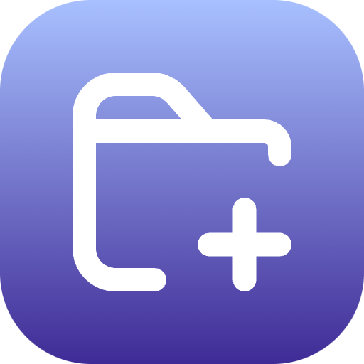

# DirDock

**DirDock** helps you **organize and access your most frequently used directories** directly from Raycast. Quickly open, manage, and navigate your important folders without leaving your keyboard.

## 🛠 Features

- **Quick Access**: Open your favorite directories with a single command.
- **Open With**: Choose a specific application to open any directory.
- **Manage Directories**: Easily add or remove directories from your list.
- **Custom Icons**: Each application in the "Open With" submenu displays its unique icon.
- **Clipboard Integration**: Copy directory paths to your clipboard instantly.
- **Lightweight & Fast**: Minimal impact on your system performance.

## 📦 Installation

- **Raycast**: Ensure you have [Raycast](https://www.raycast.com/) installed on your macOS.
- **Node.js**: Required for development. Download from [Node.js Official Website](https://nodejs.org/).

## 🤝 Contributing

Contributions are welcome!
