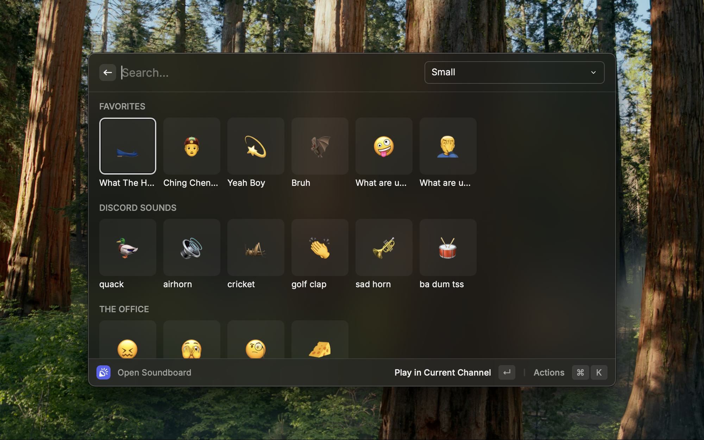

# Discord Soundboard for Raycast

Access and play Discord soundboard sounds directly from Raycast without having to switch to Discord.

## Features

- 🔊 Browse and play sounds from your Discord servers' soundboards
- 🎮 Play sounds in your current voice channel
- 🔄 Seamless synchronization with your Discord account
- 🔍 Search functionality to quickly find sounds
- 📱 Adjustable grid layout for different viewing preferences
- 🎯 Local audio preview before sending to a voice channel
- ⭐ Favorite sounds for quick access

## Requirements

- macOS 10.15 or later
- Raycast v1.50.0 or later
- Discord desktop app installed and logged in
- Discord account with access to servers that have soundboard enabled

## Usage

1. Open Raycast with your preferred shortcut
2. Type "Discord Soundboard" or "Soundboard" to find the extension
3. Press Enter to open the soundboard
4. Browse through available sounds grouped by server
5. Click on a sound to see available actions:
   - "Play in Current Channel" to send the sound to your current Discord voice channel
   - "Play" to preview the sound locally without sending it to Discord

### Tips

- Use the dropdown in the search bar to adjust the grid size
- Use ⌘+L keyboard shortcut to preview sounds locally
- Use the search functionality to quickly find specific sounds

### Favorites

You can mark sounds as favorites for quicker access:

- Favorite a sound: Select a sound and press ⌘⇧P or use the "Favorite" action
- Unfavorite a sound: Select a favorited sound and press ⌘⇧P or use the "Unfavorite" action
- Reorder favorites:
  - Move a favorite left: ⇧⌥← (shift+option+left arrow)
  - Move a favorite right: ⇧⌥→ (shift+option+right arrow)
- Clear all favorites: Select any favorited sound and use the "Unfavorite All" action (⌃⇧X)

Favorited sounds appear in their own section at the top of the soundboard for easy access.

## Troubleshooting

### Sounds Not Loading

If sounds aren't loading properly, try clicking "Sync Sounds" in the action panel to refresh your soundboard data.

### Authentication Issues

This extension automatically uses your Discord authentication from the desktop app. If you're having authentication issues:

1. Make sure you're logged into the Discord desktop app
2. Restart Raycast
3. Try the extension again

### Missing Sounds

Only sounds from servers where you have permission to use the soundboard will appear in the extension.

## Credits

Created by [lachero](https://github.com/lachero)
