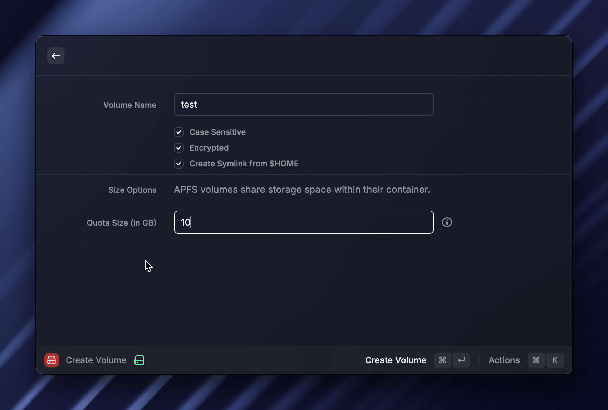

# Disk Utility

Makes it easy to manage AFPS disk volumes.

### Create Volume and Quick Create Volume

This command makes it easy to create an encrypted APFS volume. It generates a secure passphrase, creates the volume, 
and stores the passphrase in the system keychain so that the volume can be automatically decrypted and mounted on boot. 
Volume password is not stored in the user's keychain because that keychain may get deleted by password rotation.

### Showing the volumes

You can list all the mounted volumes and show details, show in finder,
create quicklink, delete the volume etc.

