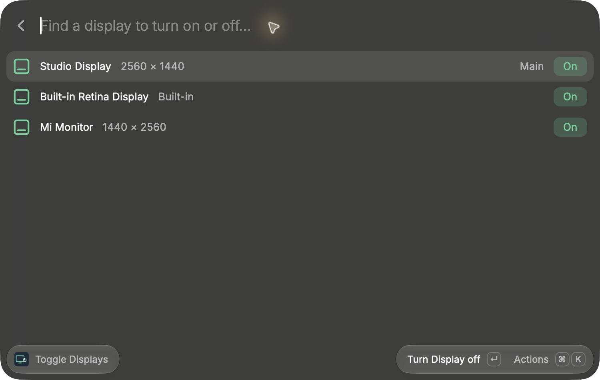
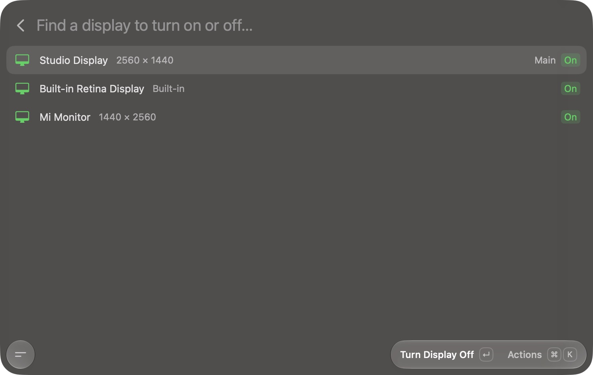

# Display Switch

Turn individual displays on and off from Raycast or Tinycast. Search by name,
press Enter to toggle, and keep disabled displays in the list so they can be
turned back on. No BetterDisplay, Homebrew, administrator access, or background
service required.



*Display Switch running in Raycast on a three-display Mac.*

<details>
<summary>Tinycast screenshot</summary>



</details>

## Commands

| Command | What it does |
| --- | --- |
| **Toggle Displays** | Lists displays with On/Off, Main, and Built-in indicators. Enter toggles the selected display. |
| **Enable All Displays** | Restores connected displays disabled by this extension. Assign a hotkey for recovery. |
| **Toggle Display by Name** | Accepts an exact display name or UUID, useful for launcher aliases and quick access. Duplicate names require a UUID. |

Within the list: **⌘R** refreshes, **⌘⇧E** enables all, and **Copy Display UUID**
provides an unambiguous identifier for identical monitors.

“Off” disables the display in the macOS desktop configuration and usually makes
it go dark. This is not a DDC hardware power command. Monitor power consumption,
sleep behavior, and wake support depend on the display, cable, and macOS version.

## Install in Tinycast

1. Download `display-switch.zip` from [Releases](https://github.com/niechen/display-switch/releases) and unzip it.
2. Open **Tinycast → Settings → Extensions** (enable extensions if needed).
3. Choose **Add from folder → Choose…**, then select the extracted `dist` folder.
4. Search **Toggle Displays** in the launcher.

The bundle includes command JavaScript and native helpers for Apple Silicon and
Intel. No build tools are needed to import it. Tinycast's GitHub registry build
runs `ray build` directly; the source distribution includes traceable, signed
helpers in `assets/`, so no native compilation is needed during installation.
Once approved in the Raycast Store, it can also be installed from that registry.

## Install in Raycast

Submitted for [Raycast Store review](https://github.com/raycast/extensions/pull/31870).
The listing will appear after approval. For a local install:

```sh
git clone https://github.com/niechen/display-switch.git
cd display-switch
npm ci --ignore-scripts
npm run dev
```

Requires macOS 13+ and Node.js 22+ for a local source install. `npm run dev`
verifies the bundled native helpers and imports the extension into Raycast.
Xcode Command Line Tools are needed only when rebuilding the Swift helper.

## Development

```sh
npm ci --ignore-scripts
npm run check
npm run build
npm run bundle
```

`dist/` is the complete importable extension. The zip contains that folder.
Native binaries are compiled from `native/DisplayControl.swift`, ad-hoc signed,
and included alongside their full source in both the source distribution and
release bundles. `native/build-manifest.json` records the source and binary
SHA-256 hashes, compiler version, and deployment target. `npm run build` checks
these hashes; `npm run build:native` rebuilds the helpers and refreshes the
manifest. See [native/README.md](native/README.md) for provenance. The macOS CI
workflow rebuilds the helpers from source before packaging.

## Safety and recovery

- Both the TypeScript controller and native helper refuse to disable the last
  independent active display. Mirrored displays must be unmirrored first.
- The helper refreshes inventory immediately before changing a display and
  checks the resulting state. CLI success alone is not treated as success.
- Disabled screens disappear from public macOS display lists on Apple Silicon.
  The helper saves their numeric identity, UUID, name, resolution, and position
  **before** switching them off, flushes the record to disk, and consults the
  full WindowServer inventory when restoring them.
- Cached identities are scoped to the current boot and never used to control
  an active display with a different UUID. Recovery restores the saved mode
  and origin where supported. Hotplug or logout can invalidate a cached ID.
- Changes apply to the current login session. A logout or reboot restores normal
  macOS display handling. No launch daemon or automatic reapplication is installed.
- Two launcher commands cannot mutate the configuration simultaneously: the
  native helper takes a nonblocking process lock.
- Display metadata lives in `~/Library/Application Support/Display Switch/`.
  Do not remove it while a display is disabled; it contains its recovery identity.
- If wake fails, run **Enable All Displays**. Reconnect an external monitor's
  cable if necessary; for a built-in screen, logout/reboot is the final recovery.

## Platform limits

macOS has no public API for disabling individual displays. This helper resolves
`SLSConfigureDisplayEnabled` and `SLSGetDisplayList` dynamically from SkyLight,
with `CGS*` fallbacks, and refuses changes if the symbols are missing. Apple can
change these private APIs in future releases. This implementation is independently
written; [displayplacer](https://github.com/jakehilborn/displayplacer) documents
this configuration mechanism and its monitor-specific reconnection limitations.

Tinycast supports the Raycast list/action components and the `child_process`
execution used here: [compatibility](https://tinycast.dev/docs/extensions/compatibility/)
and [folder installation](https://tinycast.dev/docs/extensions/installing/).
See [VALIDATION.md](VALIDATION.md) for the actual hardware and launcher checks.

Displays for which macOS cannot provide a stable UUID are omitted from the list;
they still count in the native last-display safety check. If a display turns on
but its previous resolution or position cannot be restored, the command reports
it as On and shows a layout warning. Adjust its layout in System Settings.
