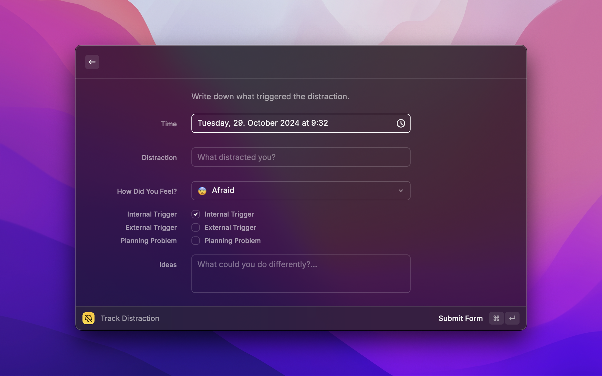
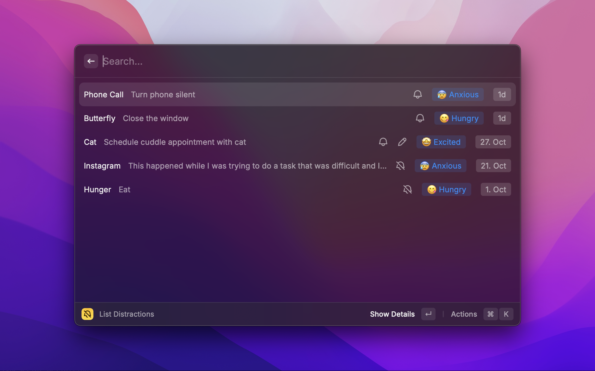
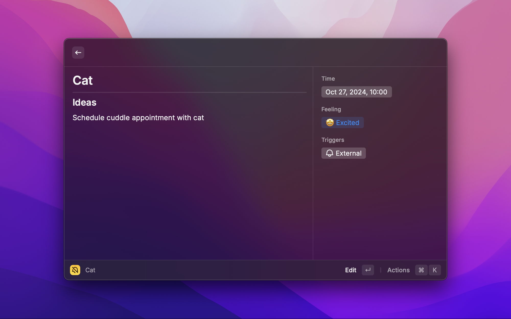

# Distraction Tracker

Track your distractions and become indistractable. This extension is inspired by Nir Eyal's book [indistractable](https://www.nirandfar.com/indistractable/).

He explains that every time we get distracted, there is usually an underlying reason, such as discomfort. The distraction is simply your body trying to escape this discomfort. A helpful tool he suggests is to log each instance of distraction to understand what triggered it and to increase awareness of why it occurred. Learn more about this technique [here](https://www.nirandfar.com/distraction-tracker/).

This extension aims to to make it very easy to implement this practice in your daily life.

## Showcase

### Track Distraction

### List Distractions

List view

Details view

