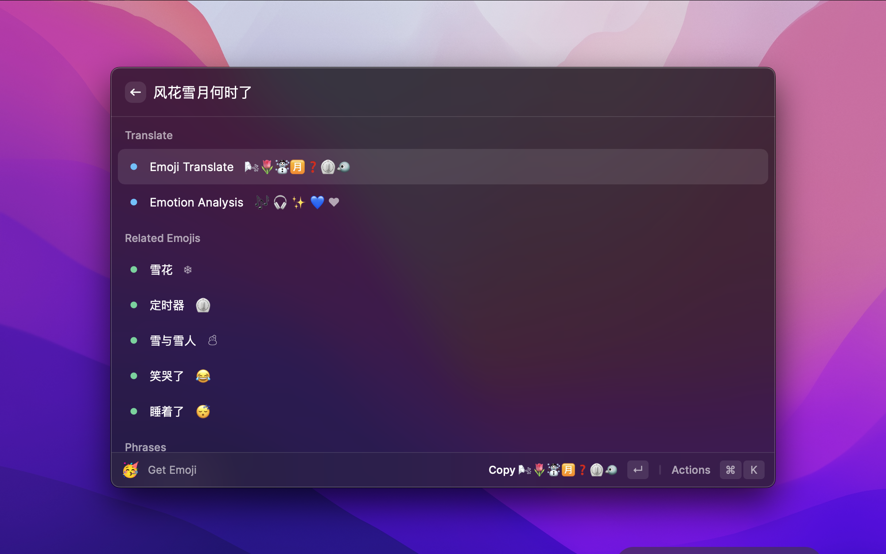

<p align="center">
  
</p>
<p align="center">
  <strong>raycast-DLmoji</strong>
</p>
<p align="center">An intelligent Emoji Dictionary🙃 helps to get related Emojis, Phrases, and Translations in Raycast, powered by <b>D</b>eep <b>L</b>earning E<b>moji</b> Prediction (<b>DLmoji</b>) and comparable intelligent APIs.</p>

## Feature

1. Supports Chinese & English Emoji Search
2. Quick translation to Emojis’ world! Supports Semantic, Verbatim or Blended Translation
3. Gets related Emojis 🐮 or Emoji Phrases 🐂🍺 with Explanations

## Using Tips



1. `Emoji Translate` can handle both Human Languages and Emojis! Powered by [EmojiTranslate](https://emojitranslate.com/) API & [EMOJIALL](https://www.emojiall.com/en/text-translator-page) Translator API.
2. `Emotion Analysis` is powered by [deepmoji](https://github.com/bfelbo/DeepMoji), trained on tweets with emojis to understand how language is used to express emotions. Note that deepmoji only used [63 kinds of emojis](https://github.com/bfelbo/DeepMoji/blob/master/emoji_overview.png) to express emotions.

## Configuration


Some APIs might cause timeout errors and be unstable. To avoid these annoying alerts, you can uncheck the corresponding APIs in the following Configuration.

To enable `Emotion Analysis`, you need to deploy deepmoji as a web service on your server. Here we offer an off-the-shelf [deepmoji docker image](https://hub.docker.com/r/thandaanda/deepmoji). If you want to use another model service, remember to follow the response format:

```json
{
    "emoji": [
        [
            {
                "emoji": "😅",
                "prob": 0.00611169869080185890
            },
            {
                "emoji": "😒",
                "prob": 0.00045027132728137076
            },
            {
                "emoji": "😫",
                "prob": 0.00971820019185543060
            },
            {
                "emoji": "😭",
                "prob": 0.01060504186898469925
            }, ...
```

Since deepmoji only supports English inputs, we further integrate Baidu Translate to support chinese query analysis. We provide the default token to access Baidu Translate API, but the server might have a request limit. 

Here we recommend users register App-ID and App-Secret in [Baidu Translate](https://fanyi-api.baidu.com/api/trans/product/prodinfo) to gain a better experience for free!

## Thanks

Inspired and based on [raycast-Parrot](https://github.com/Haojen/raycast-Parrot), `DLmoji` offers an easy-to-use Emoji Dictionary by integrating APIs from [EmojiTranslate](https://emojitranslate.com/) and [EMOJIALL](https://www.emojiall.com/). To be more intelligent, `DLmoji` also supports [deepmoji](https://github.com/bfelbo/DeepMoji) sentiment analysis API, which can find the most matching emojis of your query words.
