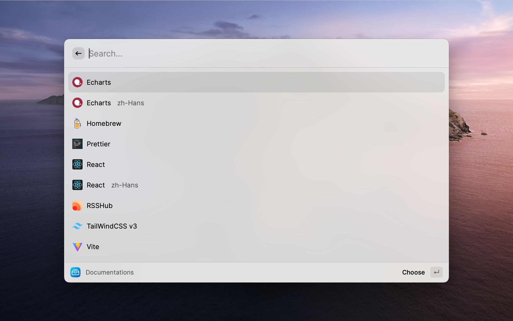
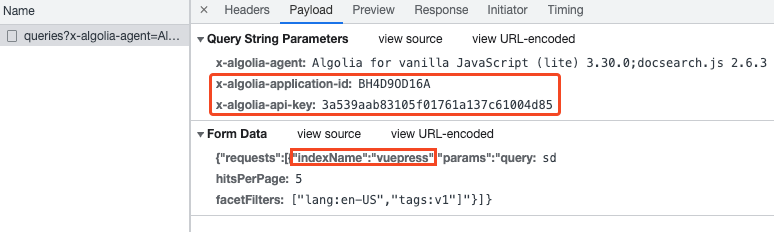
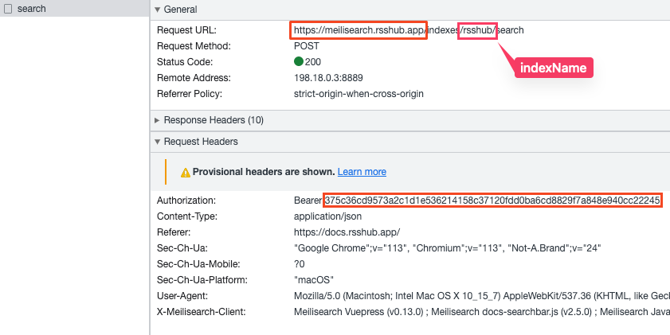

# DocSearch

Link **DocSearch** and **Meilisearch** into Raycast.



### Supported Documentations (45 documentations | 78 different versions)

|                    Documentations                     |                                                   |                                                     |
| :---------------------------------------------------: | :-----------------------------------------------: | :-------------------------------------------------: |
|              [Antd](https://ant.design/)              | [Antdv](https://antdv.com/components/overview-cn) |    [Apollo](https://www.apollographql.com/docs)     |
|         [Arthas](https://arthas.aliyun.com/)          |        [Astro](https://docs.astro.build/)         |       [Bootstrap](https://getbootstrap.com/)        |
|              [Clerk](https://clerk.dev)               |        [Dubbo](https://dubbo.apache.org/)         | [Echarts](https://echarts.apache.org/en/index.html) |
|               [Flet](https://flet.dev/)               |       [GitBook](https://docs.gitbook.com/)        |            [Homebrew](https://brew.sh/)             |
|            [IPFS](https://docs.ipfs.tech/)            |          [Laravel](https://laravel.com/)          |           [Nuxt](https://v3.nuxtjs.org/)            |
|             [NvChad](https://nvchad.com/)             |            [Pnpm](https://pnpm.io/zh)             |          [Prettier](https://prettier.io/)           |
|          [RSSHub](https://docs.rsshub.app/)           |    [Raycast](https://developers.raycast.com/)     |            [React](https://reactjs.org/)            |
| [React Bootstrap](https://react-bootstrap.github.io/) |     [React Native](https://reactnative.dev/)      |             [Remix](https://remix.run/)             |
|              [Slidev](https://sli.dev/)               |     [Taro](https://docs.taro.zone/docs/4.x/)      |        [Supabase](https://supabase.com/docs)        |
|        [TailwindCSS](https://tailwindcss.com/)        |            [Tauri](https://tauri.app/)            |           [Unidata](https://unidata.app/)           |
|              [Vite](https://vitejs.dev/)              |           [Vitest](https://vitest.dev/)           |       [Vue Router](https://router.vuejs.org/)       |
|               [Vue](https://vuejs.org/)               |           [VueUse](https://vueuse.org/)           |     [Vuepress](https://v2.vuepress.vuejs.org/)      |
|    [ElementPlus](https://element-plus.org/en-US/)     |           [Neovim](https://neovim.io/)            |            [Less](https://lesscss.org/)             |
|            [Sass](https://sass-lang.com/)             |             [Deno](https://deno.com/)             |    [TypeScript](https://www.typescriptlang.org)     |
|           [NextJS](https://nextjs.org/docs)           |      [MassTransit](https://masstransit.io/)       |          [Pinia](https://pinia.vuejs.org/)          |

### Docsearch

1. The documentation site is supported [DocSearch](https://docsearch.camunda.com/).
2. Open developer tools and input something in the search bar.
   
3. Download the site icon and put it into [assets/logo](assets/logo).
4. Input DocSearch data into [apis.ts](/src/data/apis.ts), like below.

   ```ts
   [DocID.Vuepress]: { // add a unique name to the DocID enums, then write it here
     "V1 zh-CN": { // write a tag name for this documentation version that combines both the version and the language
       icon: '../assets/logo/XXXX.png', // path to icon in the assets folder
       apiKey: '3a539aab83105f01761a137c61004d85',
       appID: 'BH4D9OD16A',
       indexName: 'vuepress',
      type: "algolia",
       homepage: 'https://vuepress.vuejs.org/',
     }
   }
   ```

5. Run the command `npm run generate`. This will create the entry file and config. After that, you can run the command `npm run dev` to test it, and `npm run build` to build it.

### Meilisearch

1. The documentation site is supported [Meilisearch](https://www.meilisearch.com/).
2. Open developer tools and input something in the search bar.
   
3. Download the site icon and put it into [assets/logo](assets/logo).
4. Input DocSearch data into [apis.ts](/src/data/apis.ts), like below.
   ```ts
   [DocID.RSSHub]: { // add a unique name to the DocID enums, then write it here
     "en-US": { // write a tag name for this documentation version that combines both the version and the language
       icon: "../assets/logo/rsshub.png", // path to icon in the assets folder
       apikey: "3a539aab83105f01761a137c61004d85",
       appid: "bh4d9od16a",
       indexname: "vuepress",
       type: "algolia",
       homepage: "https://vuepress.vuejs.org/",
     }
   }
   ```
5. Run the command `npm run generate`. This will create the entry file and config. After that, you can run the command `npm run dev` to test it, and `npm run build` to build it.

**Enjoy! Welcome to contribute.**
