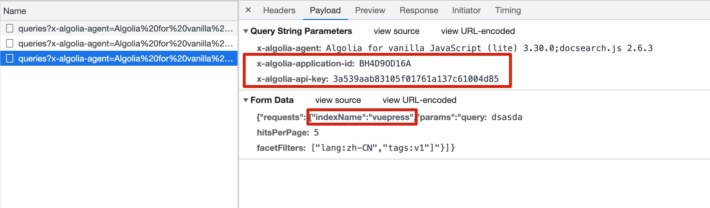

# DocSearch

Link **all DocSearch** into Raycast.


### Supported Documentation

|                        Documentations                        |                                        |                                                     |
| :----------------------------------------------------------: | :------------------------------------: | :-------------------------------------------------: |
|             [Arthas](https://arthas.aliyun.com/)             | [Bootstrap](https://getbootstrap.com/) | [Echarts](https://echarts.apache.org/en/index.html) |
| [Echarts(zh-Hans)](https://echarts.apache.org/zh/index.html) |      [Homebrew](https://brew.sh/)      |         [Laravel 9.x](https://laravel.com/)         |
|               [Prettier](https://prettier.io/)               |     [React](https://reactjs.org/)      |   [React(zh-Hans)](https://zh-hans.reactjs.org/)    |
|              [RSSHub](https://docs.rsshub.app/)              | [Slidev(zh-Hans)](https://cn.sli.dev/) |     [TailwindCSS v3](https://tailwindcss.com/)      |
|               [Unidata](https://unidata.app/)                |      [Vite](https://vitejs.dev/)       |       [Vite(zh-Hans)](https://cn.vitejs.dev/)       |
|                [Vitest](https://vitest.dev/)                 |       [Vue3](https://vuejs.org/)       |         [Vue3(zh-Hans)](https://vuejs.org/)         |
|           [Vue Router4](https://router.vuejs.org/)           |     [VueUse](https://vueuse.org/)      |     [Vuepress v1](https://vuepress.vuejs.org/)      |
|        [Vuepress v2](https://v2.vuepress.vuejs.org/)         |    [IPFS](https://docs.ipfs.tech/)     |                                                     |

### Add Other Documentation

1. The documentation web is supported [DocSearch](https://docsearch.camunda.com/).
2. Open developer tools and input something in the search bar.
   
3. Input DocSearch data into [apiData.ts](/src/algolia/apiData.ts), like below.
   ```ts
   {
        name: 'Vuepress v1',
        icon: 'https://vuepress.vuejs.org/hero.png',
        // You can find the icon URL in html head
        apiKey: '3a539aab83105f01761a137c61004d85',
        appID: 'BH4D9OD16A',
        indexName: 'vuepress',
        homepage: 'https://vuepress.vuejs.org/',
   }
   ```
4. Enjoy! Welcome to contribute.
