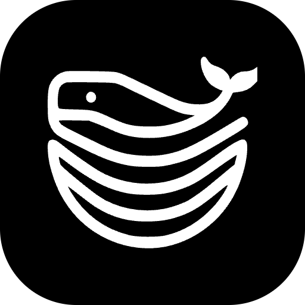

    

# Dokploy

This is a Raycast extension for [Dokploy](https://dokploy.com/) - _Deploy Anywhere with Total Freedom and Ease_. With this extension, for each **instance** you can:

- View Projects
    - View Services
        - Create Application
        - Create Database
        - Delete Service
    - View Docker (Containers)
        - View Docker Config
    - View S3 Destinations
        - Delete S3 Destination
    - View Users

## 🚀 Getting Started

1. **Install extension**: Click the `Install Extension` button in the top right of [this page](https://www.raycast.com/xmok/dokploy) OR `install` via Raycast Store

2. **Configure**:

    > API Keys are scoped to organizations, so for each organization you want to use, create an API Token for it in the Dashboard and add it as a separate instance
    
    For each instance (or organization) you have, run the "Instances" command and add -

    - Name: This can be anything you want
    - Instance URL: The URL of your Dokploy instance with port
    - API Key: `Follow` instruction from [Dokploy API | Dokploy](https://docs.dokploy.com/docs/api#authentication)

## 🧪 Tested On

Extension tested on following versions:

1. Version **v0.24.4**

---

Looking for more infra extensions? Try these:

