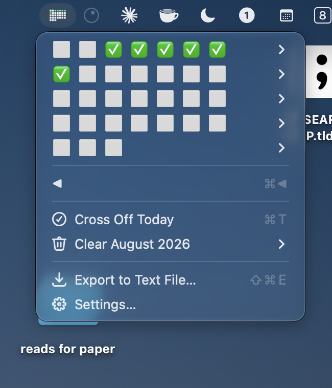

# Don't Break the Chain

A pen-and-paper mini calendar that lives in your menu bar. Cross off every day you showed up, and don't break the chain.

The calendar is drawn, not written: seven columns, one cell per real day of the month, an ✕ through the days you finished. No day numbers, no borrowed days from the month before or after — the first and last rows come out ragged, exactly like the notebook version.



## Using it

Click the calendar in the menu bar to open it. Each week is a row of boxes; open a row and click a day to cross it off or clear it again.

| Item                 | What it does                                          |
| -------------------- | ----------------------------------------------------- |
| `☐ ☒ ☒ ☐ ☐ ☐ ☐`      | One week. Open it to toggle an individual day.        |
| ◀︎ / ▶︎                | Step to the previous / next month.                    |
| Cross Off Today      | Toggles today without hunting for it (⌘T).            |
| Clear <Month>        | Wipes every cross in the month on screen. Asks first. |
| Export to Text File… | Writes every month of every chain to a `.txt` (⌘⇧E).  |

### Months don't roll over on their own

When a month ends, the calendar stays put — a finished chain is worth looking at. A ▶︎ appears; click it when you're ready to start the new month, and the 1st lands in its correct column.

◀︎ goes back as far as you like, and days in past months stay clickable, so you can fill in a day you forgot.

## Multiple chains

There are five independent calendars — one habit each. Only **Chain 1** is enabled out of the box. To add more, open Raycast Settings → Extensions → Don't Break the Chain and enable **Chain 2**–**Chain 5**. Each keeps its own marks and its own displayed month, and each can be given a name in the extension's preferences (the name only ever shows in the tooltip and in exports, never on the calendar).

## Settings

- **Week Starts On** — Monday, Sunday, or Saturday.
- **Day Style** — **Hand-Drawn** (outlined box, ✕ when done) or **Emoji** (⬜ empty, ✅ done, as pictured above). The style applies everywhere: the menu bar icon, the rows in the menu, and the export.
- **Day Letters** — off by default. Turn it on to draw the column letters above the grid.
- **Chain 1–5 Name** — optional labels.
- **Export Folder** (on the Export command) — defaults to `~/Downloads`.

## Export format

The text file draws each month the same way the menu bar does. In **Hand-Drawn** style:

```
August 2026   (10 of 31 days)

                    ┌───┬───┐
                    │   │ ╳ │
┌───┬───┬───┬───┬───┼───┼───┤
│ ╳ │ ╳ │ ╳ │ ╳ │   │   │ ╳ │
├───┼───┼───┼───┼───┼───┼───┤
│ ╳ │   │   │   │   │   │   │
├───┼───┼───┼───┼───┼───┼───┤
│ ╳ │ ╳ │ ╳ │   │   │   │   │
├───┼───┼───┼───┼───┼───┼───┤
│   │   │   │   │   │   │   │
├───┼───┴───┴───┴───┴───┴───┘
│   │
└───┘
```

…and in **Emoji** style:

```
M T W T F S S
　　　　　⬜✅
✅✅✅✅⬜⬜✅
✅⬜⬜⬜⬜⬜⬜
✅✅✅✅✅⬜⬜
⬜⬜⬜⬜⬜⬜⬜
⬜
```

## Where the marks live

Every cross is written to two places at once: a JSON file per chain under the extension's support directory, and Raycast's LocalStorage. Reads merge both, so history survives extension reloads, updates, and the loss of either store. Nothing is ever pruned — old months stay until you clear them.

## Development

```bash
npm install
npm run dev
```

`npm run dev` builds the extension into Raycast and watches for changes. Stopping it leaves the extension installed; `npm run build` refreshes it without the watcher.

## License

MIT — see [LICENSE](LICENSE).
