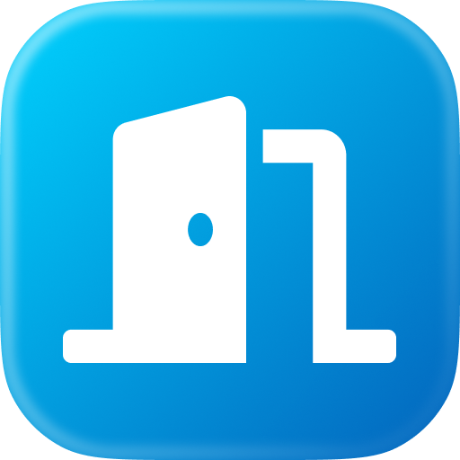
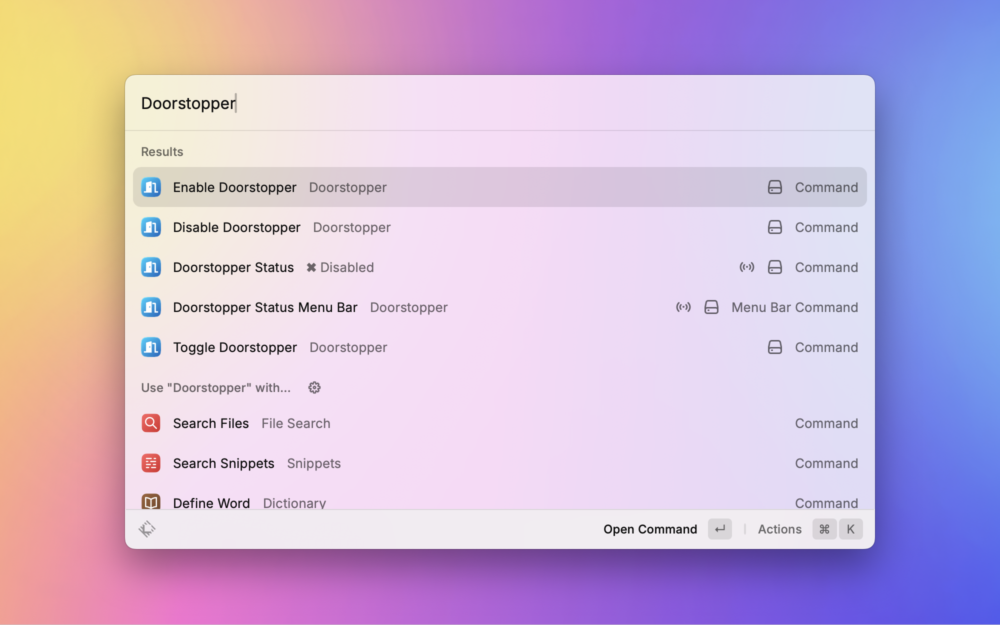

  
  <h1 align="center">Doorstopper Extension</h1>

Doorstopper is a Raycast extension which prevents your MacBook from going to sleep when you close the lid.

> **Note:**  
> The underlying commands need to be run with `sudo` privileges.  
> The extension will prompt you for your password.

## Installation 🛠️

To install the Doorstopper extension, follow these steps:

1. Open Raycast.
2. Search for "Store" and navigate to the Raycast Store.
3. Search for "Doorstopper" and click "Install."

## Usage 🚀

Once installed, simply trigger the Raycast command palette and search for the Doorstopper commands.

  

## Features ✨

### 1. `Enable Doorstopper`

This command will enable Doorstopper, preventing your MacBook from sleeping when the lid is closed.

### 2. `Disable Doorstopper`

This command will disable Doorstopper, allowing your MacBook to sleep when the lid is closed.

### 3. `Toggle Doorstopper`

This command will toggle the Doorstopper status between enabled and disabled.

### 4. `Doorstopper Status`

This command will show the current status of Doorstopper (enabled or disabled).

### 5. `Doorstopper Status Menu Bar`

This command will show the current status of Doorstopper in the menu bar.
