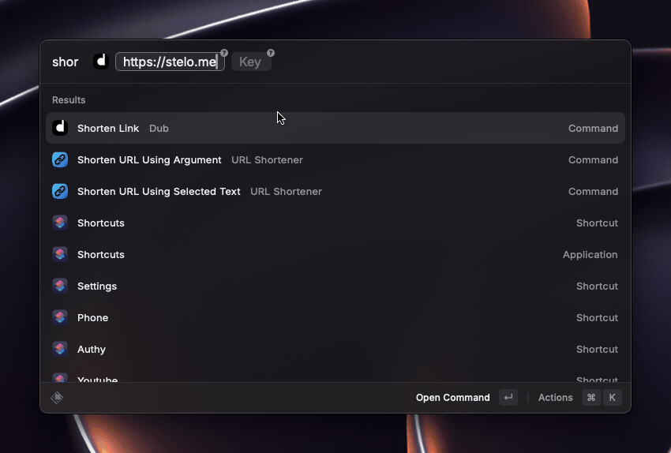

# Dub

Dub is the open-source link management platform for modern marketing teams to create marketing campaigns, link sharing features, and referral programs.

This extension allows you to shorten and retrieve your Dub links directly inside Raycast.

### Getting Started

To get started, open any command and it will prompt you to connect to you Dub instance via OAuth. You will be led to your browser where you might need to sign in to your [Dub](https://dub.co/) account.

Once you accept the new/additional scopes for Raycast Dub integration, the command will open back up with results. **You'll only be able to see this once**.

> If you used Dub API Key for this extension, you can delete them after connecting through OAuth.

> Future updates to this extension will offer more functionality that may require additional scopes be defined in this token.

### Screencast

