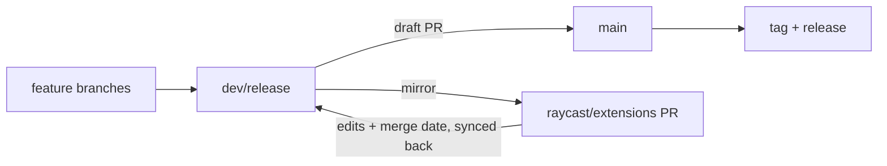

# Releasing to the Raycast Store

## Branch model

Develop on branches that merge into `dev/release`, the development and pre-release branch; `main` only carries released code. The Store receives the extension through a pull request against `raycast/extensions`. Once that PR merges, `dev/release` merges into `main` and a new release is published.



## Release steps

1. **Prepare `dev/release`** — merge the development branches that belong to this release, then update the version trio together and keep the `{PR_MERGE_DATE}` placeholder in `CHANGELOG.md`: `CHANGELOG.md`, `EASYDICT_VERSION`, and `RELEASE_MARKDOWN` in `src/consts.ts`. Run `npm run lint && npm test && npm run build` and `npm run docs:gen`; `node scripts/release.mts check` validates the trio.
2. **Open the draft PR** — `dev/release` → `main` in this repository, as a draft; it stays draft until the Store PR is merged.
3. **Open the Store PR** — mirror the extension into the Store checkout and open a PR against `raycast/extensions` (see below).
4. **Sync back** — every edit made on the Store PR, before or after it merges (reviewers, contributors, and the bot's automatic `{PR_MERGE_DATE}` replacement), comes back into `dev/release`, which also updates the draft PR.
5. **Merge and release** — after the Store merge, mark the draft PR ready and merge it into `main` (main only takes merges through the PR), then tag `X.Y.Z` and publish the release from the `RELEASE_MARKDOWN` body.

## Store checkout (once)

Fork `raycast/extensions` on GitHub, then clone the upstream repository as a partial, sparse checkout that only materializes `extensions/easydict` — a full clone is several GB:

```bash
git clone --filter=blob:none --sparse git@github.com:raycast/extensions.git <checkout>
# `origin` stays on the upstream, so `origin/main` is the PR's target base; the fork is only the push target
cd <checkout>
git remote add fork git@github.com:<your-account>/raycast-extensions.git   # any name works, e.g. a fork named `extensions`
git sparse-checkout set extensions/easydict
```

## Store PR

```bash
# In the checkout: start from a fresh branch
git -C <checkout> fetch origin
git -C <checkout> reset --hard
git -C <checkout> checkout -b ext/easydict-vX.Y.Z origin/main   # upstream main, the PR's target base

# From this repository: mirror the extension over
node scripts/release.mts sync --checkout <checkout>          # dry run
node scripts/release.mts sync --checkout <checkout> --apply

# In the checkout: commit, push, and open the PR
git -C <checkout> add extensions/easydict
git -C <checkout> commit -m "feat(easydict): release vX.Y.Z"
git -C <checkout> push fork HEAD
node scripts/release.mts pr --checkout <checkout>            # preview the PR
node scripts/release.mts pr --checkout <checkout> --apply    # open it
```

The `pr` command reads `.github/pull_request_template.md` from `origin/main`, fills `## Description` with the release notes, keeps the `## Screencast` note, ticks the `## Checklist`, detects the fork remote automatically, and opens the PR against `raycast/extensions:main`. It titles pure updates `Update easydict extension`; pass `--title '[Easydict] <summary>'` when the release carries a specific feature, `--branch` when the checkout is on another branch, and `--remote` when the fork remote cannot be detected (any fork name works, e.g. `extensions`).

Confirm the checklist claims before opening — the distribution build must have been tested in Raycast. The checkout path can also come from `RAYCAST_EXTENSIONS_CHECKOUT` instead of `--checkout`.

## Sync back

```bash
node scripts/release.mts backfill --checkout <checkout> --ref origin/main
```

The command reports the files that differ between the Store copy (`origin/main` by default, or pass the PR branch as `--ref`) and this repository, including the expected `CHANGELOG.md` date and the recompressed metadata images. Pull a file back with `git -C <checkout> show <ref>:extensions/easydict/<path> > <path>`, then commit it on `dev/release`.

## Notes

- The mirror runs through `.gitignore` and excludes `.git/`, `.claude/`, and `.github/`; `--delete` makes it one-way, so sync onto a fresh branch (`git reset --hard` first if the checkout is dirty — the mirror is reproducible from this repository).
- macOS ships openrsync: a dry run prints nothing without `-i`, which the sync script passes for you.
- Commit only `extensions/easydict` in the checkout, and keep `{PR_MERGE_DATE}` here until the Store side replaces it with the real date and you sync that back.
- Avoid `ray publish`: it re-clones the upstream repository and merges the published branch into the working directory. `npm run build` covers the same local validation.
