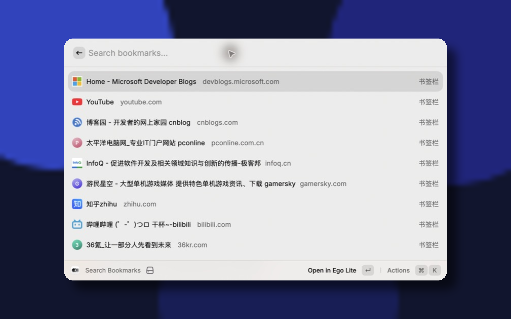
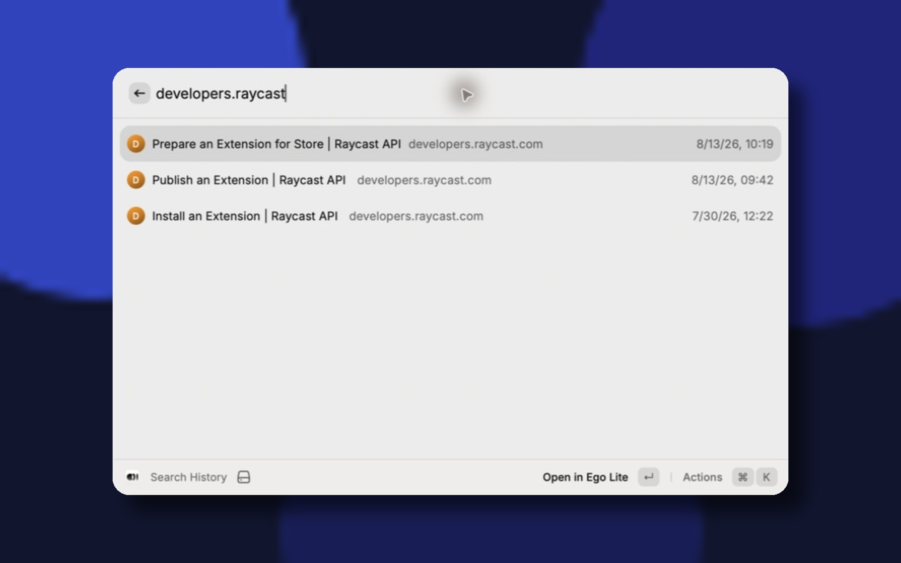
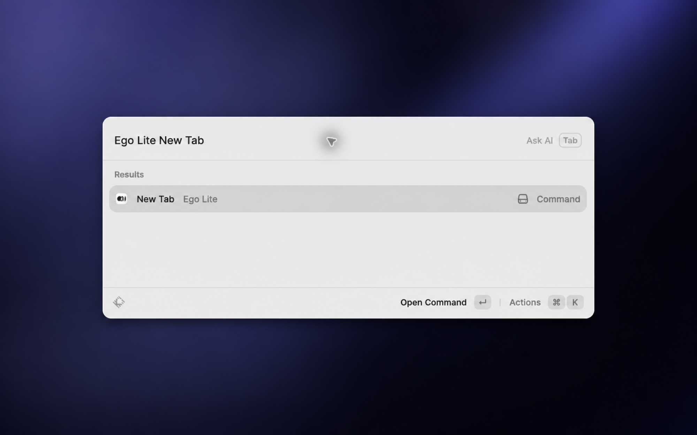

# Ego Lite for Raycast

A local-first Raycast extension for [Ego Lite](https://lite.ego.app/zh-cn), the macOS Chromium browser designed for people and AI agents to work in parallel. Ego Lite keeps agent work in separate Spaces while sharing the browser profiles, bookmarks, and signed-in browsing context you already use. Learn more on the [Ego Lite website](https://lite.ego.app/zh-cn) or in the [open-source repository](https://github.com/citrolabs/ego-lite).

## Why a dedicated Ego Lite extension?

Raycast Store has extensions with similar commands for browsers such as Brave, Vivaldi, and Firefox. This extension is intentionally specific to Ego Lite:

- It discovers and reads only Ego Lite's Chromium profile data, including Ego Lite's bookmark and history locations.
- It opens new tabs and selected results with Ego Lite's URL handler, so results return to Ego Lite rather than another installed browser.
- It complements Ego Lite's agent-browser workflow: the extension gives Raycast access to the same local browsing data, but it does not automate web pages, access account credentials, or control Ego Lite AI Task Spaces.

It is therefore not a generic Chromium extension and does not attempt to support Brave, Vivaldi, Firefox, or other browsers.

## Commands

- **New Tab** — creates and selects one blank tab in Ego Lite's normal user browsing space. If no browser window exists, Ego Lite creates one.
- **Search Bookmarks** — searches local bookmark titles, URLs, and folder paths. Results use Ego Lite's locally cached website favicon when available and a locally generated domain avatar otherwise. Opening a result creates a new Ego Lite tab.
- **Search History** — shows the 100 most recent unique URLs or searches local titles and URLs. Opening a result creates a new Ego Lite tab.

Bookmark and history results also support copying the URL, title, or Markdown link from the Action Panel.

## Requirements

- macOS 12 or newer
- [Raycast](https://www.raycast.com/)
- [Ego Lite](https://lite.ego.app/zh-cn)

The extension is tested with Ego Lite 0.4.5.8.

## Install Locally

```bash
npm install
npm run dev
```

Run these commands from the extension's root directory. Raycast imports the extension and exposes its three commands. You can stop the development process after importing; run `npm run dev` again when changing the source.

## Permissions

### Full Disk Access

Raycast may request Full Disk Access when Search History first reads Ego Lite's local Chromium History database. Allow it under:

**System Settings → Privacy & Security → Full Disk Access → Raycast**

Bookmark files can usually be read without this permission. Search History cannot query its database when macOS denies access.

## Local Data

The extension discovers the active Chromium profile from:

```text
~/Library/Application Support/Citro Labs/ego lite/Local State
```

It reads these files from the selected profile when available:

```text
AccountBookmarks
Bookmarks
Favicons
History
```

All access is read-only. The extension never creates, copies, edits, repairs, or deletes Ego Lite browser data.

## Privacy

- Bookmark and history processing stays on the Mac.
- The extension has no analytics, telemetry, remote API, or search-suggestion request.
- URLs, hostnames, history, bookmarks, and search text are not transmitted.
- Result icons stay local: cached website favicons are read directly from Ego Lite, with a generated domain avatar as fallback. The extension intentionally does not use a remote favicon provider.
- If the favicon database is unavailable or has no matching entry, bookmark search continues normally.
- The extension does not invoke `ego-browser` and does not enumerate, claim, select, or interrupt AI Task Spaces.

## Troubleshooting

### Ego Lite is not installed

Install Ego Lite from [lite.ego.app](https://lite.ego.app/zh-cn), launch it once, and retry the command.

### New Tab or Open in Ego Lite fails

Confirm that Ego Lite is installed and can open `ego://newtab` and HTTP links. Restart Ego Lite and Raycast if macOS LaunchServices temporarily stops routing URLs to the browser.

### No bookmarks appear

Create a bookmark in Ego Lite and reopen Search Bookmarks. The command checks `AccountBookmarks` first and falls back to `Bookmarks`.

### History is missing or cannot be read

Browse at least one site in Ego Lite, then reopen Search History. If the database exists but cannot be queried, grant Raycast Full Disk Access and restart Raycast.

## Development

Development requires Node.js 22.14 or newer and npm 7 or newer.

```bash
npm test
npm run lint
npm run build
```

The tests use fixtures and temporary files; they do not read the user's real bookmarks or history.

## Store Screenshots

The Store screenshots use the same blurred background and show only public, non-sensitive results from the extension. They do not include desktop content, other applications, internal sites, account identifiers, or private browsing data.

### Search Bookmarks



### Search History



### New Tab



All screenshots are PNG files at 2000 × 1250 pixels (16:10). Before publishing, make sure no screenshot exposes personal URLs, account identifiers, search queries, or browsing history.

## License

MIT
