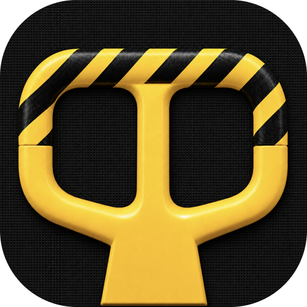

   
   
  
  <h3>Ejection Seat</h3>
  
Find the processes and files that may be preventing a disk from ejecting

   
   

macOS refuses to eject a disk and tells you "one or more programs may be using it" — without naming a single one. Ejection Seat names them. Pick a mounted volume and it shows you which processes hold filesystem references on it, what kind of reference each one holds, and what to do about it.

## What it shows

The volume list scans every mount under `/Volumes` up front, so you can see at a glance which disk is the problem before drilling in. Each volume is tagged with its blocker count.

Inside a volume, references are grouped by how likely they are to be the actual cause:

- **Likely Blockers** — a process holding a regular file open, especially one open for writing. This is what usually vetoes an eject.
- **Other References** — a mapped executable, a memory-mapped file, or a process whose working directory merely sits on the volume. Rarely the culprit on its own.
- **System Services** — Quick Look, Spotlight indexing, `fseventsd`, Time Machine. Each comes with advice specific to that service, because "quit it" is not the right answer for most of them.

Selecting a process opens a detail pane with the owning application, the PID, the user, and every path that process has open on the volume. The pane can be collapsed when you just want the list.

## What you can do about it

- **Activate the app** holding the file, so you can close the document yourself.
- **Quit the app** — a polite AppleScript quit, which still lets the app prompt you to save.
- **Show the file in Finder**, or copy the referenced paths.
- **Eject the volume** — the same request Finder makes, never a forced unmount.

When an eject fails, macOS Disk Arbitration reports the process that actually refused it. Ejection Seat surfaces that name directly, and it offers to activate that app. This is the one answer that is not a guess.

## Honest limitations

**This is a diagnostic tool, not an oracle.** Two things are worth knowing before you trust a result:

**It is a point-in-time snapshot.** A process appearing here has filesystem references on the volume. That is not proof it vetoed your eject request, and a process can open a file a moment after the scan.

**It cannot see files opened by root.** Raycast runs unprivileged, so `lsof` returns nothing for root-owned processes — which structurally hides Spotlight, Time Machine, `fseventsd`, and `revisiond`. An empty result means "nothing visible," not "nothing there." The empty state says so, because this is the failure mode most likely to mislead you.

## How it works

The extension shells out to the system `lsof` binary for each mount, parses its field output, and resolves each PID to its application bundle with `ps`. No native helper, no elevated privileges, and no third-party dependencies beyond Raycast's own.

Nothing is force-unmounted and no process is ever terminated automatically. `diskutil eject` is used rather than `unmountDisk force`, so a genuine blocker still refuses — which is the point.

## Related commands

The action panel links out to Raycast's **Eject All Disks** command and the [**Kill Process**](https://www.raycast.com/rolandleth/kill-process) extension, for when you have identified the culprit and want the bigger hammer.
