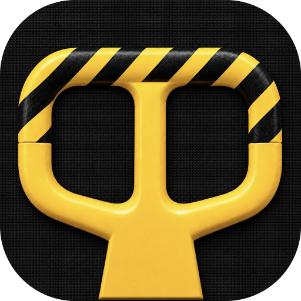

<div align="center">



# Ejection Seat

[](https://www.raycast.com/chrismessina/ejection-seat)
[](LICENSE)
[](https://github.com/chrismessina)
[](https://github.com/chrismessina/raycast-ejection-seat/stargazers)

**Find out which process is holding your disk hostage — and do something about it.**

[Features](#features) • [Requirements](#requirements) • [Quick Start](#quick-start) • [Usage](#usage) • [How It Works](#how-it-works) • [Limitations](#limitations) • [Development](#development)

</div>

---

macOS refuses to eject a disk and tells you "one or more programs may be using it" — without naming a single one. Ejection Seat names them. Pick a mounted volume and it shows which processes hold filesystem references on it, what kind of reference each one holds, and what to do about it.

---

## Features

- **Every volume Finder shows, scanned up front** — see which disk is the problem before drilling in; each volume carries its own blocker count
- **Only the volumes Finder shows** — system helper volumes mounted `nobrowse`, like `Recovery` and an external boot disk's `Preboot`, are left out of the list
- **The whole disk, not just one volume** — `diskutil eject` ejects every volume on a physical disk, so blockers on volumes that share it (hidden ones included) are listed too, and the list marks volumes that eject together
- **References ranked by how likely they are to be the cause** — a file open for writing outranks a memory-mapped executable, which outranks a process whose working directory merely sits on the volume
- **Grouped into Likely Blockers, Other References, and System Services** — so a Spotlight worker never reads as the same kind of problem as an unsaved document
- **Service-specific advice** — Quick Look, Spotlight indexing, `fseventsd`, `revisiond`, and Time Machine each get guidance that fits them, because "quit it" is the wrong answer for most of them
- **The process macOS actually blamed** — when an eject is refused, Disk Arbitration names the vetoing process, and that name is surfaced directly. It is the one answer that is not a guess
- **Resolve without leaving the list** — activate the app holding a file, politely quit it, reveal a path in Finder, or eject the volume
- **A detail pane you can collapse** — owning application, PID, user, and every referenced path, hidden with a keystroke when you just want the list

---

## Requirements

- [Raycast](https://www.raycast.com/) installed
- macOS — the extension shells out to `lsof`, `ps`, and `diskutil`

No configuration, no API keys, and no third-party dependencies beyond Raycast's own.

---

## Quick Start

1. Open Raycast and search for **"Find Ejection Blockers"**
2. Pick the volume that won't eject — every volume Finder shows under `/Volumes` is scanned as the list loads
3. Select a process to see exactly which files it has open on that volume
4. Activate or quit the responsible app, then eject

---

## Usage

### Commands

| Command | Mode | Description |
| --- | --- | --- |
| Find Ejection Blockers | `view` | Identify processes and open files that may prevent a volume from ejecting |

### Sections

| Section | What lands here |
| --- | --- |
| Likely Blockers | A process holding a regular file open — especially for writing. This is what usually vetoes an eject |
| Other References | A mapped executable, a memory-mapped file, or a working directory on the volume. Rarely the culprit alone |
| System Services | Quick Look, Spotlight, `fseventsd`, Time Machine — each with advice specific to that service |

### Actions

| Action | Description |
| --- | --- |
| Activate App | Bring the app holding the file forward so you can close the document yourself |
| Quit App | A polite AppleScript quit — the app can still prompt you to save |
| Show in Finder | Reveal a referenced path |
| Copy Process ID / Copy All Referenced Paths | Copy details for a bug report or a script |
| Hide Sidebar / Show Sidebar | Collapse or restore the detail sidebar (⌘⇧D) — remembered across launches |
| Refresh Scan | Re-scan after you have closed something |
| Eject Volume | The same request Finder makes — never a forced unmount. Reported as ejected only once the volume has actually gone |

---

## How It Works

The extension reads the disk layout from `diskutil list` and the mount flags from `mount`, then shells out to the system `lsof` binary once per volume, covering the volume and every other volume on the same physical disk. It parses `lsof`'s field output and resolves each PID to its application bundle with `ps`. No native helper, no elevated privileges, no third-party packages.

References are ranked by what `lsof` actually reports: a regular file open for writing outranks one open for reading, which outranks a mapped executable or a bare working directory.

Nothing is force-unmounted and no process is ever terminated automatically. `diskutil eject` is used rather than `unmountDisk force`, so a genuine blocker still refuses — which is the point. When it does refuse, macOS Disk Arbitration reports the process responsible, and that is surfaced verbatim. When it succeeds, the mount point is checked before the extension reports success, because an exit status is not proof the volume has gone.

---

## Limitations

**This is a diagnostic tool, not an oracle.** Two things are worth knowing before you trust a result.

**It is a point-in-time snapshot.** A process appearing here has filesystem references on the volume. That is not proof it vetoed your eject request, and a process can open a file a moment after the scan.

**It cannot see files opened by root.** Raycast runs unprivileged, so `lsof` returns nothing for root-owned processes — which structurally hides Spotlight, Time Machine, `fseventsd`, and `revisiond`. An empty result means "nothing visible," not "nothing there." The empty state says so, because this is the failure mode most likely to mislead you.

---

## Development

### Project Structure

```
raycast-ejection-seat/
├── src/
│   └── find-ejection-blockers.tsx    # The single command
├── assets/                           # Extension icon (runtime)
├── media/                            # README images
├── metadata/                         # Store screenshots
├── package.json
└── tsconfig.json
```

### Scripts

| Script | Description |
| --- | --- |
| `npm run dev` | Start in development mode with hot reload |
| `npm run build` | Build for production |
| `npm run lint` | Run Raycast ESLint config |
| `npm run fix-lint` | Auto-fix lint issues |
| `npm run publish` | Publish to the Raycast Store |

### Clone & Run

```sh
git clone https://github.com/chrismessina/raycast-ejection-seat.git
cd raycast-ejection-seat
npm install
npm run dev
```

---

## Tech Stack

| Package | Role |
| --- | --- |
| `@raycast/api` | Raycast extension primitives |
| `@raycast/utils` | Higher-level Raycast utilities |

---

## Related Commands

The action panel links out to Raycast's **Eject All Disks** command and the [**Kill Process**](https://www.raycast.com/rolandleth/kill-process) extension, for when you have identified the culprit and want the bigger hammer.

Since [Raycast 2.6.0](https://www.raycast.com/changelog/macos/2-6), Eject All Disks names the disks it could not eject and shows the macOS error. Ejection Seat answers the next question: which process is holding that disk, and what to do about it.

---

MIT © [Chris Messina](https://github.com/chrismessina)
