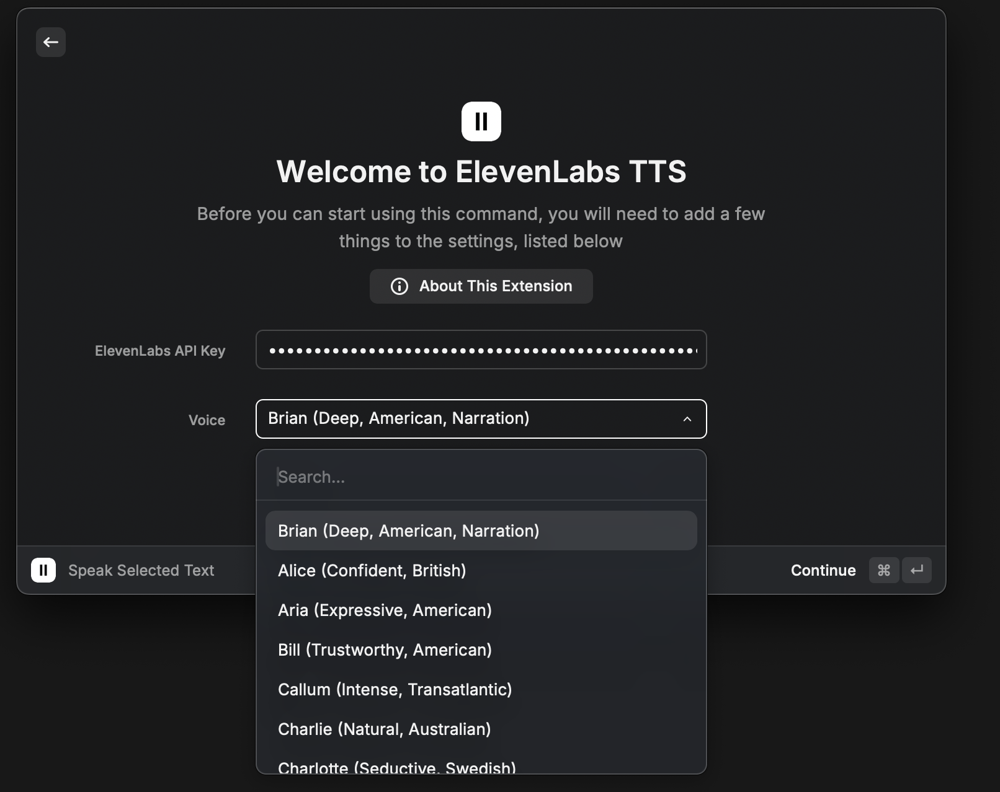
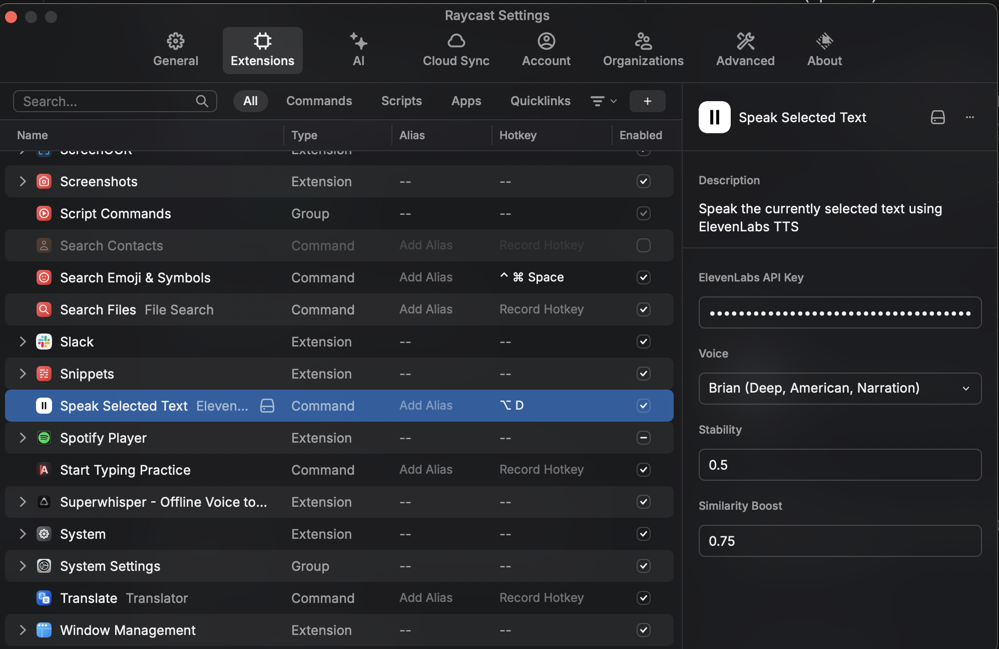

# ElevenLabs TTS for Raycast

🎙️ Transform any text into natural-sounding speech instantly with ElevenLabs' premium AI voices - right from your Raycast!

[Watch Demo](https://www.loom.com/share/d340fc09e88c47f1a032c0da291f3cc3)

## ✨ Features

- 🚀 Instant text-to-speech conversion with a simple keyboard shortcut
- 🎭 20+ premium AI voices with unique personalities and accents
- 🎛️ Fine-tune voice stability and clarity to match your needs
- 🔊 Real-time streaming playback
- ⚡️ Zero configuration needed - just add your API key and go!

## 🚀 Quick Start

1. Install from Raycast Store
2. Add your ElevenLabs API key ([Get one here](https://elevenlabs.io))
3. Set up your preferred hotkey in Raycast (⌘ + ,)
4. Pick your favorite voice and start speaking!

## 📋 Requirements

- Raycast v1.50.0+
- ElevenLabs API key
- macOS 10.15+

## Usage

1. Select any text in any application
2. Press your configured hotkey (e.g., ⌘ + Shift + S)
3. The selected text will be read aloud
4. Press the same hotkey again to stop playback at any time

💡 **Important**: By default, no hotkey is assigned. You'll need to:

1. Open Raycast Settings (⌘ + ,)
2. Go to Extensions
3. Find "Speak Selected Text"
4. Click "Add Hotkey" to set your preferred keyboard shortcut

## ⚙️ Advanced Settings

- **Stability** (0.0 - 1.0): Controls voice consistency. Higher values make the voice more stable but potentially less expressive.
- **Similarity Boost** (0.0 - 1.0): Adjusts how closely the output matches the original voice. Higher values increase similarity but may impact performance.

## 💡 Pro Tips

- Use shorter text segments for faster response times
- Experiment with different stability settings for each voice to find your perfect balance
- The extension works with any text-based application including browsers, editors, and documents

## 🔍 Troubleshooting

- If no sound plays, check your API key and internet connection
- Ensure you have sufficient credits in your ElevenLabs account
- For long texts, consider breaking them into smaller segments

## 🤝 Contributing

Found a bug or have a feature request? Please open an issue on GitHub!

## 📝 License

MIT License - feel free to use and modify as needed.

## 🙏 Credits

- [ElevenLabs](https://elevenlabs.io) for their amazing Text-to-Speech API
- [Raycast](https://raycast.com) for the excellent extension platform
