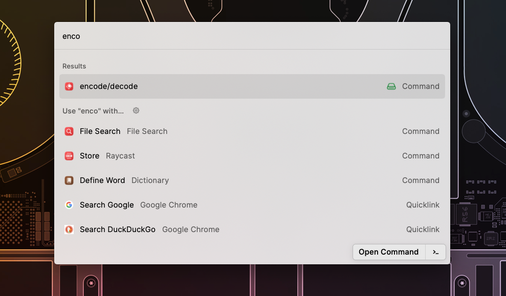

# encode-decode

Encode or decode input text in base64/url and copy to clipboard with **only few steps**

- Toggle raycast
- Run the command
- Input the text to encode or decode
- Select the result and press `enter` to copy to clipboard

