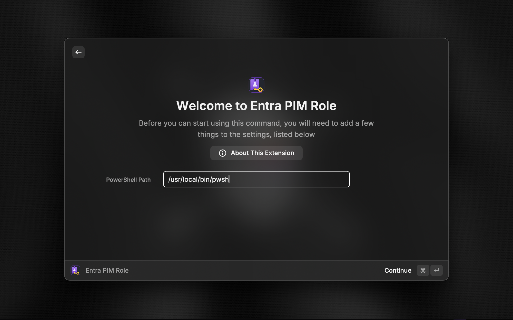
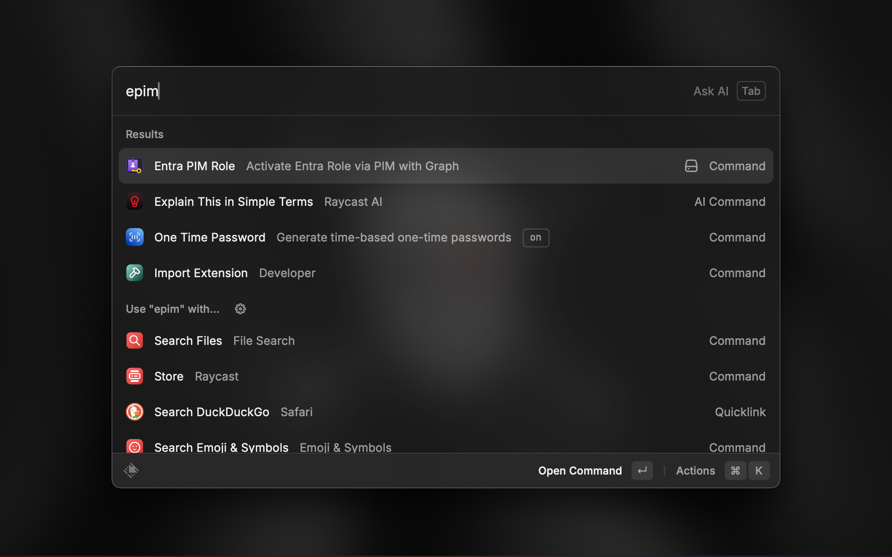
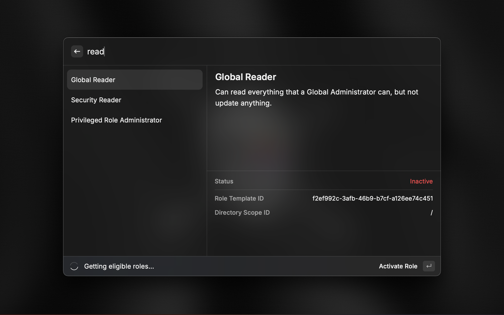
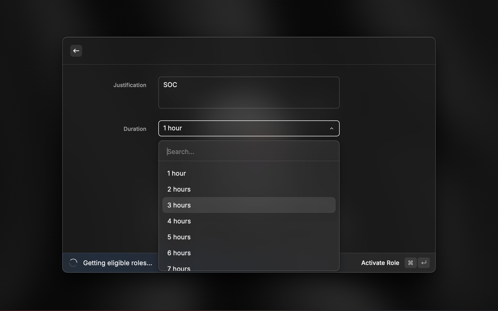
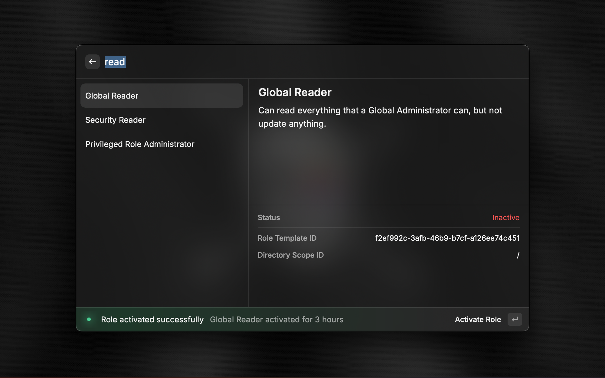
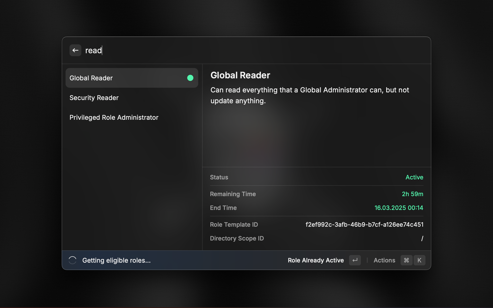

# Entra PIM Role

Activate Entra roles via PIM using Microsoft Graph API directly from Raycast.

## Installation

1. Ensure you have Raycast installed.
2. Ensure that PowerShell for macOS is installed.
3. Ensure that the following PowerShell modules are installed.
```powershell
Install-Module Microsoft.Graph.Authentication
Install-Module Microsoft.Graph.Identity.Governance
```

## Usage

1. Search for "Entra PIM Role" or "epim" (Short command).
2. Select the command to view your eligible roles.
3. Choose a role to activate and fill out the "justification & duration" form.
4. Submit the form to activate the role.

## Preferences

- **PowerShell Path**: Set the full path to your PowerShell executable in the extension preferences.

## Contributing

Contributions are welcome! Please ensure any changes are accompanied by updates to the `CHANGELOG.md` and follow the existing code style.

## Screenshots

<p align="center">
    
    
    
    
    
    
</p>

## License

This extension is licensed under the MIT License.
