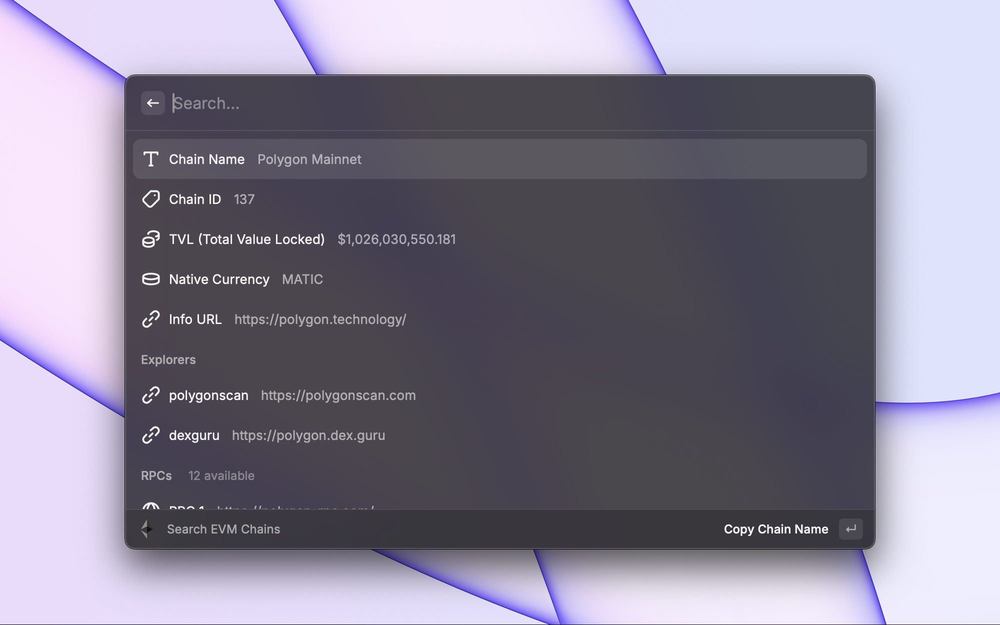
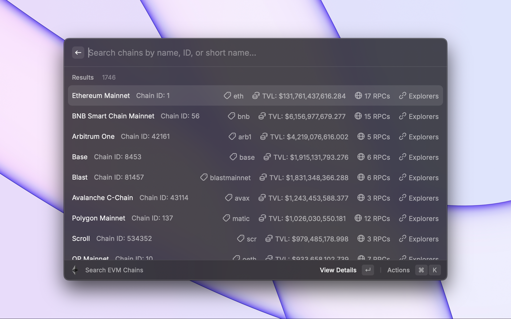
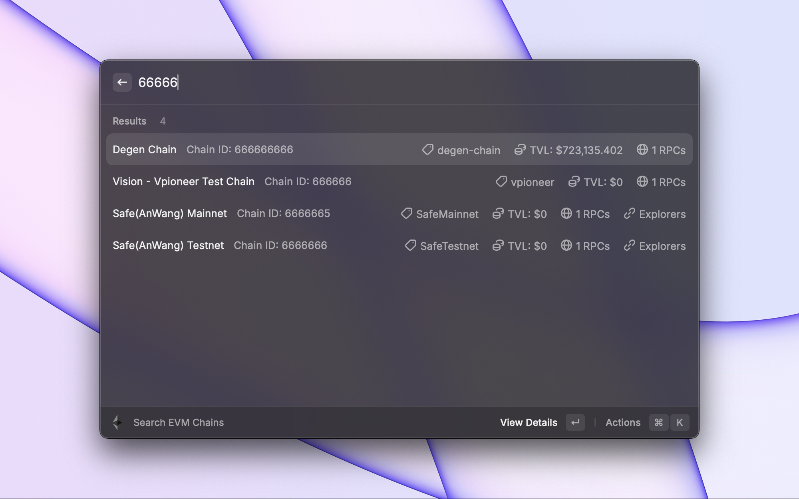

 
 

<h1 align="center">EVM Search</h1>

A Raycast extension that helps with quickly finding EVM network information.

## Motivation

I spend alot of time looking up EVM network information, like what chain a chainID belongs to, a block explorer for a new L2, or a quick RPC to use. To do this in the past, i would usually just visit chainlist.org and search for the chain, which can be time consuming if done often enough.

This extensions uses the chainid.network API to provide this information directly as a quick search in Raycast.

## Features

- Search for a chain by name, chainId, or short-name (e.g. 'eth', 'bsc', 'matic')
- Chains are sorted by TVL (Total Value Locked)
- Chain Info includes:
  - Name
  - ChainId
  - Currency Symbol
  - TVL
  - Block Explorers
  - RPCs

## Installation

From the Raycast Extension Library, search for "EVM Search".

Or:

1. Clone this repo `git clone https://github.com/d3or/raycast-evm-search.git`
2. Go to the folder `cd raycast-evm-search`
3. Install dependencies `npm install`
4. Go to Raycast, run `Import Extension` and select the folder

### Examples

#### Displays list of EVM networks sorted by TVL.

#### Search for a chain by chainID

#### Chain Info

## Credits

- Uses the [chainid.netork](https://chainid.network/) API to get EVM network information.
- Uses the [llama.fi](https://llama.fi/) API to get TVL data.

## License

MIT License
