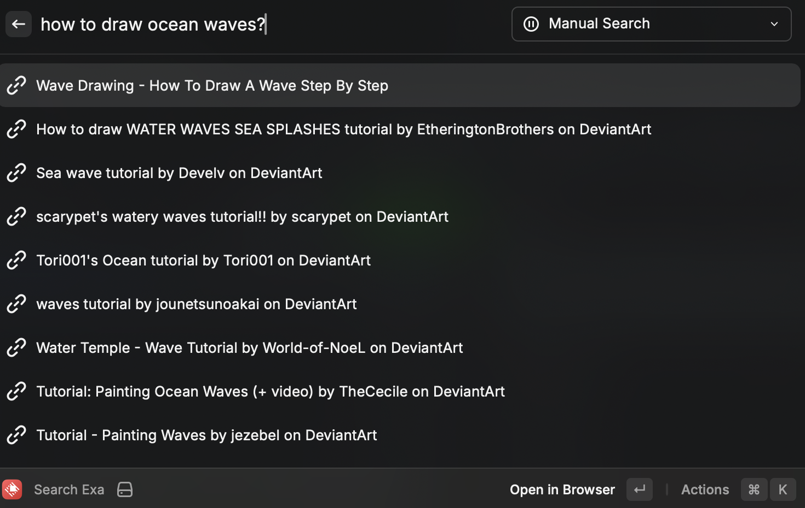

# Exa AI Search

Search the web using Exa's AI-powered semantic search engine right from Raycast.

## Features

- AI-powered semantic search results
- Press Enter to execute search
- Quick copy URLs with ⌘C
- View full result previews
- Date information when available

## Setup

1. Get an API key from [Exa](https://exa.ai)
2. Add your API key in the extension settings

## Usage

1. Open Raycast and type "exa"
2. Type your search query
3. Press Enter to execute the search
4. Press Enter again to open any result in your browser
5. Use ⌘C to copy result URLs
6. Use ⌘K to access additional actions

