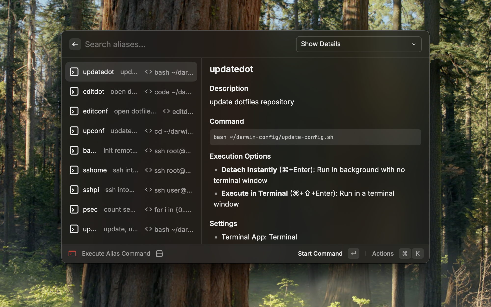
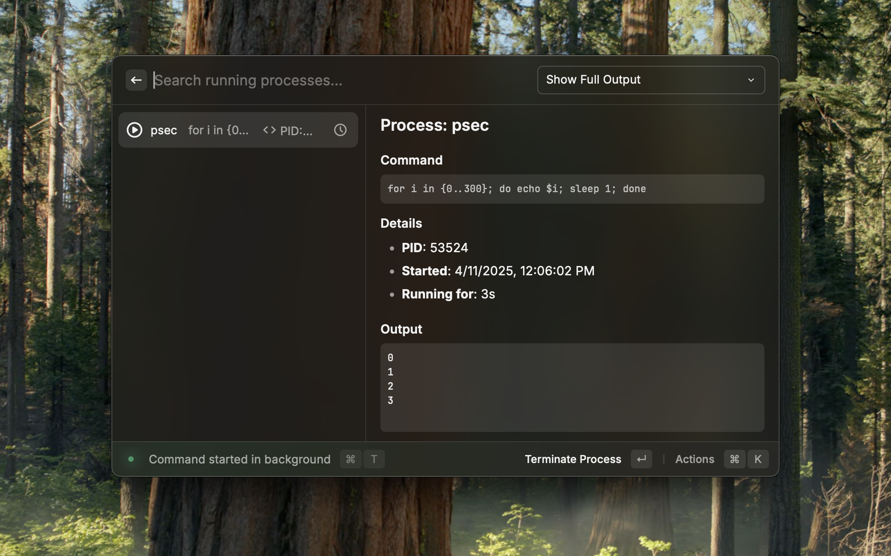

# Execute Alias Command

A powerful Raycast extension for managing and executing shell aliases from your terminal configuration file.



## What It Does

This extension lets you:

- List and search all aliases defined in your shell configuration file
- Execute aliases with two different modes:
  - Detach instantly (run in background)
  - Open in your preferred terminal
- Monitor running processes and their output
- Terminate long-running commands when needed

## Who It's For

This extension is perfect for:

- **Command Line Power Users** who have many aliases defined and want quick access
- **Developers** who frequently use the same terminal commands
- **DevOps Engineers** who manage systems through terminal commands
- **Anyone** who wants faster access to their frequently used terminal commands

## Features

### Command Management

- Search and filter all your shell aliases
- View detailed descriptions from comment annotations
- Choose how you want to execute each command

### Execution Options

- **Detach Instantly (⌘+Enter)**: Run in background with no terminal window
- **Execute in Terminal (⌘+⇧+Enter)**: Open command in your preferred terminal

### Process Management

- View all running processes started from the extension
- Monitor command output in real-time
- Terminate processes with a single click
- Open log files in your text editor



### Customization

- Configure your preferred terminal emulator
- Set your shell configuration file path
- Control how many lines of output to display
- Toggle between detailed and list views

## Configuration

### Terminal App

Set your preferred terminal application (defaults to Apple Terminal):

- Terminal (default)
- iTerm
- Alacritty
- Warp
- Hyper
- Or any other terminal you have installed

### Alias File Path

Specify the location of your shell configuration file (defaults to ~/.zshrc):

- ~/.zshrc (zsh)
- ~/.bashrc (bash)
- ~/.config/fish/config.fish (fish)
- Any other shell configuration file containing aliases

## Special Comment Annotations

Add special comments to your aliases for better organization:

```bash
# man: This is a description of what the alias does
alias mycommand="some command"

# hideraycast
alias hiddencommand="command to hide from Raycast"
```

- `# man:` - Provides a description that appears in the extension
- `# hideraycast` - Hides this alias from appearing in the extension

## Keyboard Shortcuts

- **⌘+Enter**: Detach and run command in background
- **⌘+⇧+Enter**: Execute command in terminal
- **⌘+M**: Open the process manager
- **⌘+C**: Copy command to clipboard
- **⌘+⇧+C**: Copy alias name to clipboard

## Process Management

The Process Manager allows you to:

- View all running processes
- See command output in real-time
- Terminate processes (⌘+X)
- Open log files in TextEdit (⌘+O)
- View process in Activity Monitor (⌘+A)
- Refresh the process list (⌘+R)

You can also control how much output to show:

- Full output
- Last 50 lines
- Last 100 lines
- Last 200 lines

## Installation

This extension can be installed directly from the Raycast extensions store.

## Contributing

Contributions are welcome! Please open an issue or submit a pull request on [GitHub](https://github.com/felixwortmann/execute-alias-command).

## License

This project is licensed under the MIT License - see the [LICENSE](LICENSE) file for details.
