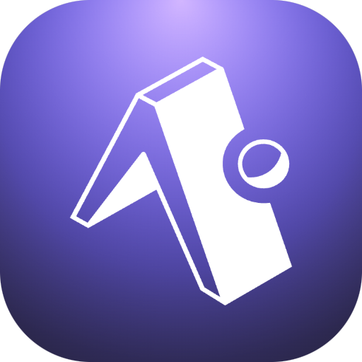

# Expo Raycast Extension

  

## Overview

The Expo Raycast Extension allows you to manage your Expo.dev projects, Apple devices, and environment variables directly from Raycast. This extension provides a seamless way to interact with your Expo projects, view and manage Apple devices, and handle environment variables without leaving your Raycast environment.

## Features

- **Login**: Authenticate with your Expo account.
- **Manage Projects**: View and manage your Expo projects, including builds, submissions, and updates.
- **Apple Devices**: View, create, and edit Apple devices registered with your Expo account.
- **Environment Variables**: View, create, edit, and delete environment variables for your Expo projects.

### Login

1. Open Raycast and search for "Expo Login".
2. Enter your Expo account credentials.
3. Once logged in, your session will be saved, and you can use other commands.

### Manage Projects

1. Open Raycast and search for "Manage Projects".
2. Select a project to view its details, including builds, submissions, and updates.
3. Perform actions such as viewing activity, builds, submissions, and updates.

### Apple Devices

1. Open Raycast and search for "Apple Devices".
2. View the list of Apple devices registered with your Expo account.
3. Add new devices by scanning a QR code or edit existing devices.

### Environment Variables

1. Open Raycast and search for "Environment Variables".
2. Select a project to view its environment variables.
3. Create, edit, or delete environment variables as needed.

## Project Structure

- **src**: Contains the source code for the extension.
  - **components**: Reusable components used across the extension.
  - **lib**: Utility functions, constants, and types.
  - **views**: Different views for managing projects, devices, and environment variables.
  - **commands**: Entry points for different commands (e.g., login, manage projects).

## Dependencies

- `@raycast/api`: Raycast API for building extensions.
- `@raycast/utils`: Utility functions for Raycast extensions.
- `@tanstack/react-query`: Data-fetching library for React.
- `axios`: Promise-based HTTP client.
- `qrcode`: QR code generation library.
- `typescript`: TypeScript for type checking.
- `eslint`: Linting tool for JavaScript and TypeScript.
- `prettier`: Code formatter.

## Scripts

- `build`: Build the extension.
- `dev`: Run the extension in development mode.
- `fix-lint`: Fix linting issues.
- `lint`: Run linting.
- `publish`: Publish the extension to the Raycast Store.

## Contributing

Contributions are welcome! Please follow these steps:

1. Fork the repository.
2. Create a new branch for your feature or bugfix.
3. Make your changes and commit them.
4. Push your changes to your fork.
5. Create a pull request to the main repository.

## License

This project is licensed under the MIT License.

## Author

- **Patrick Web** - [patrick-web](https://github.com/patrick-web)

## Acknowledgements

- Thanks to the Raycast team for providing an excellent platform for building productivity tools.
- Thanks to the Expo team for creating a powerful framework for building cross-platform applications.

---

Feel free to reach out if you have any questions or need further assistance. Happy coding! 🚀
