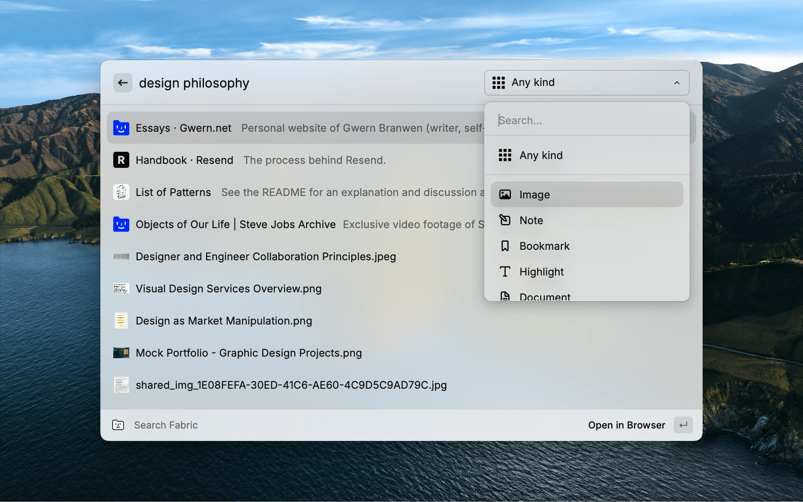

# Fabric

Quickly search and create in Fabric's intelligent workspace

[Fabric](https://fabric.so) is your second brain and self-organizing personal cloud. Remember everything.

A home for all your projects, ideas, files, notes, and links.

 

This extension brings Fabric's capabilities directly into Raycast, allowing you to search your knowledge base and create new content without switching contexts.

  

## Extension features

 

• __Search Fabric:__ Instantly find anything in your Fabric workspace using AI-powered natural language search

• __Create Notes:__ Quickly capture ideas and information

• __Create Bookmarks:__ Save important links and web pages with visual previews

  

## Why Fabric?

 

[Fabric](https://fabric.so) functions as your second brain, automatically organizing your digital content using AI. Whether you're collecting research, managing projects, or building a knowledge base, Fabric helps you remember everything and never lose an idea again.

 

• **Universal content hub:** Store and access notes, files, links, images, videos, and audio in one place

• **AI-powered organization:** Let artificial intelligence automatically structure and interconnect your information

• **Smart search:** Find anything instantly with natural language queries

• **Real-time collaboration:** Work together with live updates, shared cursors, and instant notifications

• **Web clipper:** Save articles, PDFs, and entire web pages with visual previews

• **AI assistant:** Interact with your knowledge using natural language

This extension integrates Fabric's core functionality into your Raycast workflow, boosting productivity by eliminating context switching and helping you capture information efficiently.

  

## Get started

 

1. Install the extension

2. Connect to your [Fabric.so](https://fabric.so) account

3. Start searching and creating content directly from Raycast

 

Transform how you collect and organize information with Fabric and Raycast working together.
