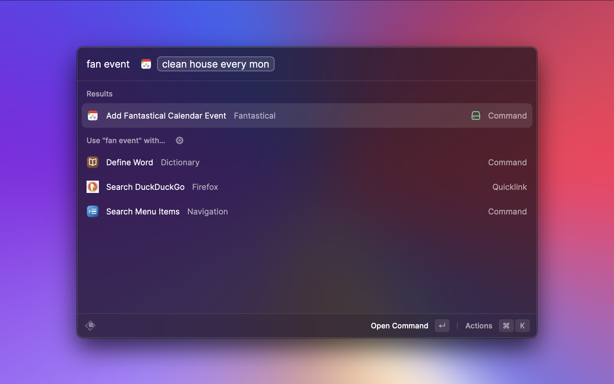
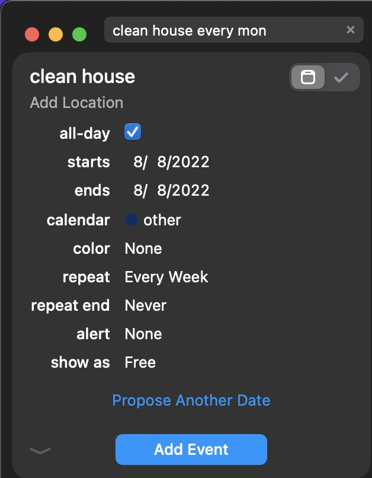
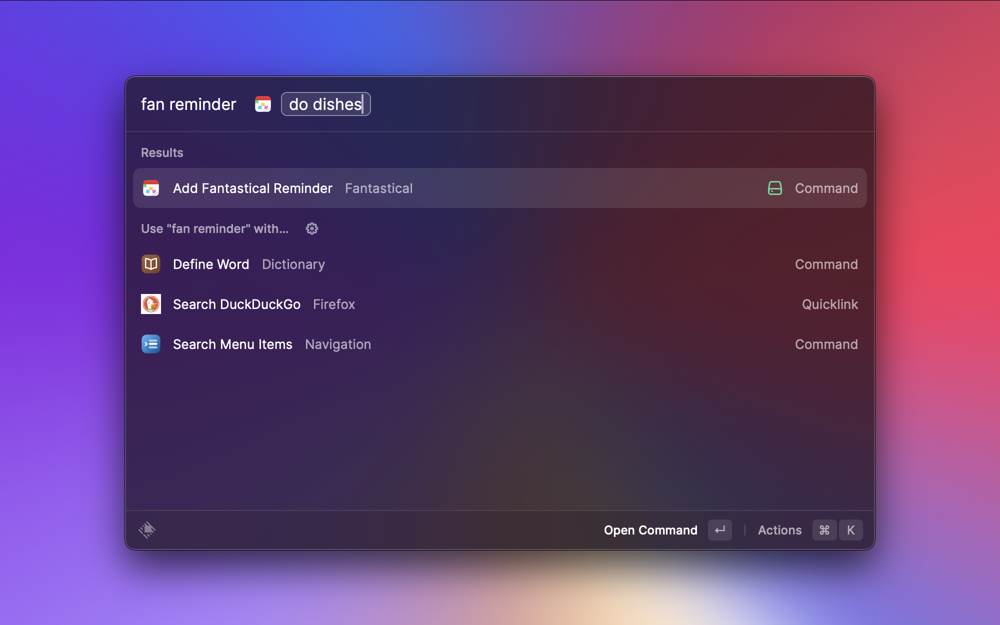
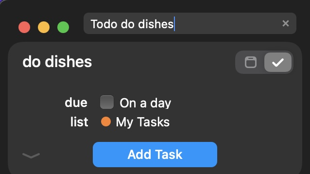
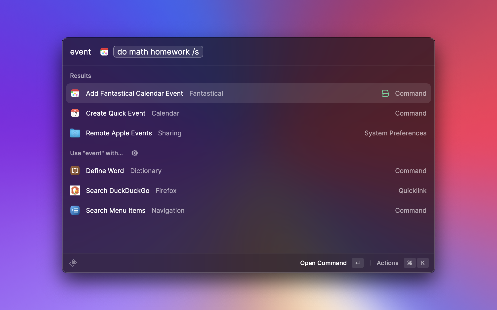
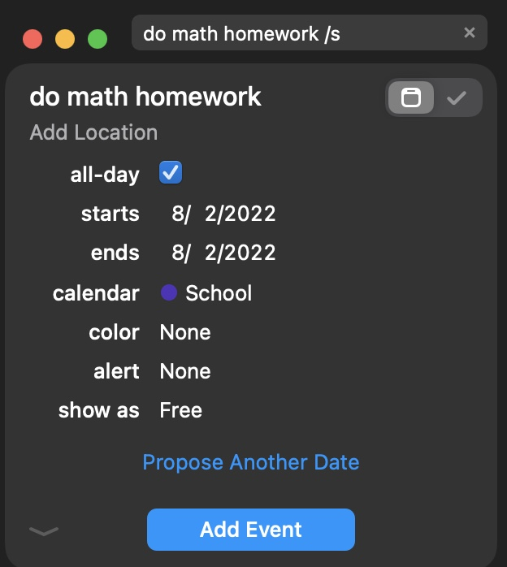

# Fantastical in Raycast

This extension utilizes Fantastical natural language processing to add events and reminders from Raycast
- [Fantastical in Raycast](#fantastical-in-raycast)
    - [Adding Events](#adding-events)
    - [Adding Reminders](#adding-reminders)
    - [Adding a list or calendar to an event or reminder](#adding-a-list-or-calendar-to-an-event-or-reminder)
  - [Contributing](#contributing)
### Adding Events

You can add events simply by typing `fan add event`, `add event` or `event` then type the event you want to add.

This will use Fantastical natural language processing to add events. If you are unfamiliar with Fantastical natural language processing you can read more [here](https://flexibits.com/fantastical/help/adding-events-and-tasks).

Here is an example of adding an event:

After adding Fantastical will open with the event in the top right corner as can be seen here:

Now you can choose to change any details or just add it to your calendar by pressing enter.

### Adding Reminders

Similarly to adding events, you can add reminders simply by typing `fan add reminder`, `add reminder` or `reminder` then type the reminder you want to add.

This will prepend the TODO keyword in front of the text that gets sent to Fantastical which will then create a reminder so its natural language processing will also be used.

Here is an example of adding a reminder:

This too will open Fantastical with the reminder in the top right corner as can be seen here:

Same as before you can now choose to change any details or just add it to your calendar by pressing enter.

### Adding a list or calendar to an event or reminder

To add a specific calender or list you can use / and then type the name of the calender or list.
You can just type part of the name and Fantastical will find the best match.

An example can be seen here:

Which will result in the following after running the command:

As you can see Fantastical figured out what calender was meant just from the /s and the calender that the event now is added to is the one specified.

*Note: The calender needs to exits prior to adding the event or reminder.*

If you are unsure on how to add calenders you can read more [here](https://flexibits.com/fantastical-ios/help/adding-calendars).

## Contributing

If you want to contribute to this extension you can fork the [GitHub repository](https://github.com/devahschaefers/fantastical-raycast) and make a pull request describing your changes.

Also feel free to open an issue if you have any questions or suggestions.
